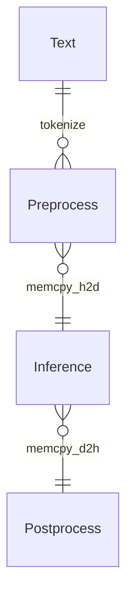

<p align="center">
  <picture>
    <source media="(prefers-color-scheme: dark)" srcset="https://github.com/NLPOptimize/flash-tokenizer/blob/main/assets/FlashTokenizer_main_dark.png?raw=true">
    
  </picture>
</p>
<h1 align="center">
The world's fastest CPU tokenizer library!
</h1>


## LLM推論サービングのための効率的で最適化されたトークナイザーエンジン

[FlashTokenizer](https://pypi.org/project/flash-tokenizer/) は、LLM推論で使用されるBertTokenizerをC++で実装した**高性能トークナイザー**です。[FlashAttention](https://github.com/Dao-AILab/flash-attention) や [FlashInfer](https://github.com/flashinfer-ai/flashinfer) と同様に、あらゆるトークナイザーの中で最高レベルの速度と精度を誇り、transformersの`BertTokenizerFast`よりも**10倍高速**です。


### [▶️ パフォーマンスベンチマークデモ動画](https://www.youtube.com/watch?v=a_sTiAXeSE0)


> [!NOTE]  
> ### なぜか？
> - 私たちは、[Huggingface の BertTokenizerFast](https://github.com/huggingface/transformers/blob/main/src/transformers/models/bert/tokenization_bert_fast.py) よりも **高速で、精度が高く、使いやすいトークナイザ** を必要としています。([リンク1](https://stackoverflow.com/questions/75595699/huggingfaces-berttokenizerfast-is-between-39000-and-258300-times-slower-than-ex), [リンク2](https://github.com/PaddlePaddle/PaddleNLP/issues/8565), [リンク3](https://blog.csdn.net/xhw205/article/details/129578988))
> - [PaddleNLP の BertTokenizerFast](https://paddlenlp.readthedocs.io/en/stable/_modules/paddlenlp/experimental/faster_tokenizer.html) は、[Huggingface の Rust 実装](https://github.com/huggingface/tokenizers) を `C++` に移植することで **1.2倍の性能向上** を達成しました。ただし、使用するには巨大な [PaddlePaddle](https://github.com/PaddlePaddle/Paddle) および [PaddleNLP](https://github.com/PaddlePaddle/PaddleNLP) のパッケージをインストールする必要があります。
> - [Tensorflow-text の FastBertTokenizer](https://www.tensorflow.org/text/api_docs/python/text/FastBertTokenizer) は、実際には他と比較して **パフォーマンスが劣る** 結果を示しています。
> - [Microsoft の Blingfire](https://github.com/microsoft/BlingFire) は、**カスタムデータでの学習に8時間以上かかり**、精度も相対的に低いです。
> - [Rapid の cuDF](https://github.com/rapidsai/cudf) は GPU ベースの BertTokenizer を提供しますが、**精度の問題**を抱えています。
> - 残念ながら、[FastBertTokenizer](https://github.com/georg-jung/FastBertTokenizer) や [BertTokenizers](https://github.com/NMZivkovic/BertTokenizers) は `C#` で開発されており、`Python` では使用できません。
> 
> - これらの理由から、私たちは **`FlashTokenizer` を開発しました**。これは `pip` で簡単にインストールでき、**保守性の高い C++ で開発されています**。さらに、**非常に高速な性能を保証**します。私たちの実装は Blingfire よりも高速で、使いやすさも向上しています。FlashTokenizer は、[Fast WordPiece Tokenization](https://arxiv.org/abs/2012.15524) で提案された **LinMax Tokenizer** をベースに実装されており、**線形時間でのトークナイズ**を実現しています。さらに、**C++ レベルでのバッチエンコードにおける並列処理**もサポートしており、卓越したスピードを実現しています。
> 


<p align="center">
  <picture>
    <source media="(prefers-color-scheme: dark)" srcset="https://github.com/NLPOptimize/flash-tokenizer/blob/main/assets/Banner_dark.png?raw=true">
    
  </picture>
</p>


<p>


</p><br>

* * *


### FlashTokenizerには以下の主要な機能が含まれています
> [!TIP]
> 
> * C++17で実装。
>   ***MacOS**: `clang++`。
>   ***Windows**: `Visual Studio 2022`。
>   ***Ubuntu**: `g++`。
>
> * pybind11を介してPythonでも同様に高速。
> * OPENMPを使用したC++レベルでの並列処理をサポート。
>


## ニュース
> [!IMPORTANT]  
> **[2025年4月2日]**
> - パフォーマンスベンチマークコードを追加
> - パフォーマンスベンチマークはPythonを使用して実施され、必要なパッケージは[setup.sh](./perftest/setup.sh)を通じてインストールできます。
> - `BasicTokenizer`に`tokenize_early_stop`機能を追加することで、わずかなパフォーマンス向上を達成しました。
> - [OpenMP](https://www.openmp.org/)はWindows、Linux、macOSすべてにおいて`std::thread`よりも優れたパフォーマンスを示したため、OpenMPのみを使用するように切り替えました。
> 
> **[2025年3月31日]**
> - 各OS用のビルド済みwhlファイルを提供するように変更しました。
>
> **[2025年3月22日]**
>
> - AC Trieに[DFA](https://blog.cloudflare.com/pt-br/making-waf-ai-models-go-brr/#:~:text=We%20can%20also%20tune%20Aho,settings%20based%20on%20this%20recommendation)を追加しました。
>
> **[2025年3月21日]**
> - トークナイザーの精度向上
>
> **[2025年3月19日]** 
> - [Aho–Corasick](https://en.wikipedia.org/wiki/Aho%E2%80%93Corasick_algorithm)アルゴリズムからLinMaxMatchingを適用することによるメモリ削減とわずかなパフォーマンス向上。
> - すべての関数のブランチパイプラインを改善し、強制インライン化を適用。
> - `WordpieceTokenizer(Backward)`の不要な操作を削除。
> - [Bloomフィルター](https://en.wikipedia.org/wiki/Bloom_filter)を除いたすべての関数の最適化はキャッシングよりも高速。
> - `punctuation`、`control`、`whitespace`は事前にconstexprとして定義され、Bloomフィルターとして使用されます。
> - 統計的メモリプロファイリングにより不要なメモリ割り当てを削減。
> - ✨FlashTokenizer✨では、`bert-base-uncased`は単一コアで1秒あたり**35K**テキストを処理でき、テキストあたりの処理時間は約**28ns**です。
>
> **[2025年3月18日]** 
> - BasicTokenizerの精度向上により、全体的な精度が向上し、特にUnicode入力に対してより正確な結果が得られるようになりました。
>
> **[2025年3月14日]** 
> - [Fast WordPiece Tokenization](https://arxiv.org/abs/2012.15524)で紹介された[Trie](https://en.wikipedia.org/wiki/Trie)を使用して、`WordPieceTokenizer`と`WordPieceBackwordTokenizer`のパフォーマンスが向上しました。
> - SingleEncodingでは`std::list`に`FastPoolAllocator`を使用することでパフォーマンスが向上しますが、スレッドセーフではないため、BatchEncodingでは`std::list<std::string>`がそのまま使用されています。BatchEncodingでは`OPENMP`が完全に削除され、`std::thread`のみが使用されています。
>
> **[2025年3月10日]** 
> - robin_hoodによる高速トークンマッピングと**std::list**によるメモリコピーの最小化によるパフォーマンス向上。
>
>
> #### トークンIDマップテーブルパフォーマンステスト
>
> トークンとIDのマップには最速の`robin_hood::unordered_flat_map<std::string, int>`を使用しました。
>
> **[2025年3月9日]** BertTokenizer用のflash-tokenizerの開発が完了しました。
> 


## 1. インストール
### 必要条件
 * `Windows(AMD64)`, `MacOS(ARM64)`, `Ubuntu(x86-64)`。
 * `g++` / `clang++` / `MSVC`。
 * `python 3.8 ~ 3.13`。
### [PIP](https://pypi.org/project/flash-tokenizer/)からインストール
Windowsでは、[vc_redist.x64.exe](https://github.com/NLPOptimize/flash-tokenizer/releases/download/Packages/VC_redist.x64.exe)をインストールする必要があります。

```bash
# Windows
pip install -U flash-tokenizer
```
```bash
# Linux
pip install -U flash-tokenizer
```
```bash
# MacOS
pip install -U flash-tokenizer
```

### ソースからインストール
```bash
git clone https://github.com/NLPOptimize/flash-tokenizer
cd flash-tokenizer/prj
pip install .
```


## 2. サンプル

```python
from flash_tokenizer import BertTokenizerFlash
from transformers import BertTokenizer

titles = [
    '绝不能放弃，世界上没有失败，只有放弃。',
    'is there any doubt about it "None whatsoever"',
    "세상 어떤 짐승이 이를 드러내고 사냥을 해? 약한 짐승이나 몸을 부풀리지, 진짜 짐승은 누구보다 침착하지.",
    'そのように二番目に死を偽装して生き残るようになったイタドリがどうして初めて見る自分をこんなに気遣ってくれるのかと尋ねると「私が大切にする人たちがあなたを大切にするから」と答えては'
]

tokenizer1 = BertTokenizerFlash.from_pretrained('bert-base-multilingual-cased')
tokenizer2 = BertTokenizer.from_pretrained('bert-base-multilingual-cased')

correct = 0
for title in titles:
    print(title)
    tokens1 = tokenizer1.tokenize(title)
    tokens2 = tokenizer2.tokenize(title)
    ids1 = tokenizer1(title, max_length=512, padding="longest").input_ids[0]
    ids2 = tokenizer2(title, max_length=512, padding="longest", return_tensors="np").input_ids[0].tolist()
    if tokens1 == tokens2 and ids1 == ids2:
        correct += 1
        print("Accept!")
    else:
        print("Wrong Answer")
    print(ids1)
    print(ids2)
    print()

print(f'Accuracy: {correct * 100.0 / len(titles):.2f}%')
```

```
绝不能放弃，世界上没有失败，只有放弃。
Accept!
[101, 6346, 2080, 6546, 4284, 3704, 10064, 2087, 5621, 2078, 4917, 4461, 3204, 7480, 10064, 2751, 4461, 4284, 3704, 1882, 102]
[101, 6346, 2080, 6546, 4284, 3704, 10064, 2087, 5621, 2078, 4917, 4461, 3204, 7480, 10064, 2751, 4461, 4284, 3704, 1882, 102]

is there any doubt about it "None whatsoever"
Accept!
[101, 10124, 11155, 11178, 86697, 10978, 10271, 107, 86481, 12976, 11669, 23433, 107, 102]
[101, 10124, 11155, 11178, 86697, 10978, 10271, 107, 86481, 12976, 11669, 23433, 107, 102]

세상 어떤 짐승이 이를 드러내고 사냥을 해? 약한 짐승이나 몸을 부풀리지, 진짜 짐승은 누구보다 침착하지.
Accept!
[101, 9435, 14871, 55910, 9710, 48210, 10739, 35756, 9113, 30873, 31605, 11664, 9405, 118729, 10622, 9960, 136, 9539, 11102, 9710, 48210, 43739, 9288, 10622, 9365, 119407, 12692, 12508, 117, 9708, 119235, 9710, 48210, 10892, 9032, 17196, 80001, 9783, 119248, 23665, 119, 102]
[101, 9435, 14871, 55910, 9710, 48210, 10739, 35756, 9113, 30873, 31605, 11664, 9405, 118729, 10622, 9960, 136, 9539, 11102, 9710, 48210, 43739, 9288, 10622, 9365, 119407, 12692, 12508, 117, 9708, 119235, 9710, 48210, 10892, 9032, 17196, 80001, 9783, 119248, 23665, 119, 102]

そのように二番目に死を偽装して生き残るようになったイタドリがどうして初めて見る自分をこんなに気遣ってくれるのかと尋ねると「私が大切にする人たちがあなたを大切にするから」と答えては
Accept!
[101, 11332, 24273, 2150, 5632, 5755, 1943, 4805, 1980, 2371, 7104, 11592, 5600, 1913, 4814, 1975, 27969, 15970, 21462, 15713, 21612, 10898, 56910, 22526, 22267, 2547, 19945, 7143, 1975, 6621, 2534, 1980, 28442, 60907, 11312, 4854, 7770, 14813, 18825, 58174, 75191, 11662, 3456, 1945, 100812, 1890, 5949, 1912, 3197, 2535, 84543, 2179, 78776, 111787, 22946, 20058, 11377, 3197, 2535, 84543, 16867, 1891, 1940, 6076, 27144, 11588, 102]
[101, 11332, 24273, 2150, 5632, 5755, 1943, 4805, 1980, 2371, 7104, 11592, 5600, 1913, 4814, 1975, 27969, 15970, 21462, 15713, 21612, 10898, 56910, 22526, 22267, 2547, 19945, 7143, 1975, 6621, 2534, 1980, 28442, 60907, 11312, 4854, 7770, 14813, 18825, 58174, 75191, 11662, 3456, 1945, 100812, 1890, 5949, 1912, 3197, 2535, 84543, 2179, 78776, 111787, 22946, 20058, 11377, 3197, 2535, 84543, 16867, 1891, 1940, 6076, 27144, 11588, 102]

Accuracy: 100.00%
```

## 3. 他の実装


<p align="center">
  <picture>
    <source media="(prefers-color-scheme: dark)" srcset="./assets/logos_dark.png">
    
  </picture>
</p>


ほとんどの[BERT](https://arxiv.org/abs/1810.04805)ベースのモデルは[WordPiece Tokenizer](https://static.googleusercontent.com/media/research.google.com/ja//pubs/archive/37842.pdf)を使用しており、そのコードは[こちら](https://github.com/google-research/bert/blob/master/tokenization.py)で見つけることができます。
（Huggingfaceのシンプルな実装は[こちら](https://github.com/huggingface/transformers/blob/main/src/transformers/models/bert/tokenization_bert.py)にあります）。
BertTokenizerはCPU集約型アルゴリズムであるため、推論がボトルネックになることがあり、最適化されていないトークナイザーは非常に遅くなる可能性があります。良い例として[KR-BERT](https://arxiv.org/abs/2008.03979)で紹介された[BidirectionalWordpieceTokenizer](https://github.com/snunlp/KR-BERT/blob/master/krbert_tensorflow/tokenization_ranked.py)があります。コードのほとんどは同じですが、アルゴリズムはサブトークンを後ろ向きに走査し、前向きの走査と比較してより大きな値を書き込みます。論文では精度向上を主張していますが、他の定量的な指標を見つけるのは難しく、精度向上は顕著ではなく、トークナイザーは深刻に遅くなります。
* transformers（Rust実装、PyO3）
* paddlenlp（C++実装、pybind）
* tensorflow-text（C++実装、pybind）
* blingfire（C++実装、ネイティブバイナリ呼び出し）
ほとんどの開発者は`transformers.BertTokenizer`または`transformers.AutoTokenizer`を使用しますが、`AutoTokenizer`を使用すると`transformers.BertTokenizerFast`が返されます。
当然、BertTokenizerよりも高速ですが、結果は完全に同じではないため、トークナイザーの段階から100%の精度を諦めていることになります。
BertTokenizerはtransformersだけでなく、[PaddleNLP](https://github.com/PaddlePaddle/PaddleNLP)や[tensorflow-text](https://www.tensorflow.org/text)でも提供されています。
また、Microsoftによって開発され、現在は放棄されている[Blingfire](https://github.com/microsoft/BlingFire)もあります。
PaddleNLPはPaddlePaddleを必要とし、バージョン3.0rcからトークナイザー機能を提供しています。以下のようにインストールできます

```bash
##### Install PaddlePaddle, PaddleNLP
python -m pip install paddlepaddle==3.0.0b1 -i https://www.paddlepaddle.org.cn/packages/stable/cpu/
pip install --upgrade paddlenlp==3.0.0b3
##### Install transformers
pip install transformers==4.47.1
##### Install tf-text
pip install tensorflow-text==2.18.1
##### Install blingfire
pip install blingfire
```


blingfireを除いて、vocab.txtだけあればすぐにトークナイザーを実行できます。
（blingfireもvocab.txtのみを必要とし、8時間の学習後に使用できます）。
詳しく見ていく実装は`PaddleNLPのBertTokenizerFast`と`blingfire`です。
* `blingfire`：[決定性有限状態機械（DFSM）](https://github.com/microsoft/BlingFire/blob/master/doc/Bling_Fire_Tokenizer_Algorithms.pdf)を使用して1つの線形スキャンと不要な比較を排除し、O(n)の時間を実現しています。これは印象的です。
  ***利点**：他の実装よりも**5〜10倍高速**。
  ***欠点**：長い学習時間（8時間）と他の実装よりも低い精度。（+事実上の開発中断により助けを得るのが困難）。
* `PaddleNLP`：以下の実験で示されているように、PaddleNLPは常にBertTokenizerFast（HF）と同じ小数点以下の桁数で高速であり、X86かArmかにかかわらず、どのOSでも常に高速です。
  ***利点**：**内部実装はC++で書かれています** Rustで実装された`transformers.BertTokenizerFast`と比較して、完全に同じ値を出力しながら1.2倍高速です。
    * `return_tensors`で`pt(pytorch tensor)`を指定することはできませんが、これは問題ではありません。
  ***欠点**：PaddlePaddleとPaddleNLPをインストールする必要があること以外はありません。
  
  
## 4. パフォーマンステスト

### 4.1 パフォーマンステスト（単一テキストエンコーディング）

精度は[googleのBertTokenizerFast](https://github.com/google-research/bert/blob/master/tokenization.py)をベースラインとして測定した結果です。`input_ids`のうち1つでも不正確であれば、回答は不正確とみなされます。


<p align="center">
  <picture>
    <source media="(prefers-color-scheme: dark)" srcset="./assets/comp_speed_dark.png">
    
  </picture>
</p>

<p align="center">
  <picture>
    <source media="(prefers-color-scheme: dark)" srcset="./assets/comp_accuracy_dark.png">
    
  </picture>
</p>


### トークナイザーパフォーマンス比較

#### [google-bert/bert-base-cased](https://huggingface.co/google-bert/bert-base-cased)

| Tokenizer                      | Elapsed Time | texts     | Accuracy |
|--------------------------------|----------------:|-----------:|------------:|
| BertTokenizerFast(Huggingface) | 84.3700s     | 1,000,000 | 99.9226% |
| BertTokenizerFast(PaddleNLP)   | 75.6551s     | 1,000,000 | 99.9226% |
| FastBertTokenizer(Tensorflow)  | 219.1259s    | 1,000,000 | 99.9160% |
| Blingfire                      | 13.6183s     | 1,000,000 | 99.8991% |
| **FlashBertTokenizer**             | 8.1968s      | 1,000,000 | 99.8216% |

#### [google-bert/bert-base-uncased](https://huggingface.co/google-bert/bert-base-uncased)

| Tokenizer                      |   Elapsed Time |     texts |   Accuracy |
|--------------------------------|----------------:|-----------:|------------:|
| BertTokenizerFast(Huggingface) |       91.7882s | 1,000,000 |   99.9326% |
| BertTokenizerFast(PaddleNLP)   |       83.6839s | 1,000,000 |   99.9326% |
| FastBertTokenizer(Tensorflow)  |      204.2240s | 1,000,000 |   99.1379% |
| Blingfire                      |       13.2374s | 1,000,000 |   99.8588% |
| **FlashBertTokenizer**             |        7.6313s | 1,000,000 |   99.6884% |

#### [google-bert/bert-base-multilingual-cased](https://huggingface.co/google-bert/bert-base-multilingual-cased)


| Tokenizer                      | Elapsed Time | texts     | Accuracy |
|--------------------------------|----------------:|-----------:|------------:|
| BertTokenizerFast(Huggingface) | 212.1570s    | 2,000,000 | 99.7964% |
| BertTokenizerFast(PaddleNLP)   | 193.9921s    | 2,000,000 | 99.7964% |
| FastBertTokenizer(Tensorflow)  | 394.1574s    | 2,000,000 | 99.7892% |
| Blingfire                      | 38.9013s     | 2,000,000 | 99.9780% |
| **FlashBertTokenizer**             | 20.4570s     | 2,000,000 | 99.8970% |


#### [beomi/kcbert-base](https://github.com/Beomi/KcBERT)

| Tokenizer                      |   Elapsed Time |     texts |   Accuracy |
|--------------------------------|----------------:|-----------:|------------:|
| BertTokenizerFast(Huggingface) |       52.5744s | 1,000,000 |   99.6754% |
| BertTokenizerFast(PaddleNLP)   |       44.8943s | 1,000,000 |   99.6754% |
| FastBertTokenizer(Tensorflow)  |      198.0270s | 1,000,000 |   99.6639% |
| Blingfire                      |       13.0701s | 1,000,000 |   99.9434% |
| **FlashBertTokenizer**             |        5.2601s | 1,000,000 |   99.9484% |


| Tokenizer                      |   Elapsed Time |     texts |   Accuracy |
|--------------------------------|----------------|-----------|------------|
| **FlashBertTokenizer**             |        5.1875s | 1,000,001 |   99.9484% |
| Blingfire                      |       13.2783s | 1,000,001 |   99.9435% |
| rust_tokenizers(guillaume-be)  |       16.6308s | 1,000,001 |   99.9829% |
| BertTokenizerFast(PaddleNLP)   |       44.5476s | 1,000,001 |   99.6754% |
| BertTokenizerFast(Huggingface) |       53.2525s | 1,000,001 |   99.6754% |
| FastBertTokenizer(Tensorflow)  |      202.1633s | 1,000,001 |   99.6639% |

#### [microsoft/llmlingua-2-bert-base-multilingual-cased-meetingbank](https://huggingface.co/microsoft/llmlingua-2-bert-base-multilingual-cased-meetingbank)

| Tokenizer                      |   Elapsed Time |     texts |   Accuracy |
|--------------------------------|----------------:|-----------:|------------:|
| BertTokenizerFast(Huggingface) |      208.8858s | 2,000,000 |   99.7964% |
| BertTokenizerFast(PaddleNLP)   |      192.6593s | 2,000,000 |   99.7964% |
| FastBertTokenizer(Tensorflow)  |      413.2010s | 2,000,000 |   99.7892% |
| Blingfire                      |       39.3765s | 2,000,000 |   99.9780% |
| **FlashBertTokenizer**             |       22.8820s | 2,000,000 |   99.8970% |

| Tokenizer                      |   Elapsed Time |     texts |   Accuracy |
|--------------------------------|----------------|-----------|------------|
| **FlashBertTokenizer**             |       22.0901s | 2,000,001 |   99.8971% |
| Blingfire                      |       37.9836s | 2,000,001 |   99.9780% |
| rust_tokenizers(guillaume-be)  |       98.0366s | 2,000,001 |   99.9976% |
| BertTokenizerFast(PaddleNLP)   |      208.6889s | 2,000,001 |   99.7964% |
| BertTokenizerFast(Huggingface) |      219.2644s | 2,000,001 |   99.7964% |
| FastBertTokenizer(Tensorflow)  |      413.9725s | 2,000,001 |   99.7892% |

#### [KR-BERT](https://github.com/snunlp/KR-BERT)


| Tokenizer                                    |   Elapsed Time |     texts |   Accuracy |
|--------------------------------|----------------:|-----------:|------------:|
| BertTokenizerBidirectional(KR-BERT Original) |      128.3320s | 1,000,000 |  100.0000% |
| **FlashBertTokenizer(Bidirectional)**                           |       10.4492s | 1,000,000 |   99.9631% |





## 6. 互換性

FlashBertTokenizerはどのフレームワークでも使用できます。各フレームワークのCUDAバージョンの互換性もLLMの高速推論には重要です。
 * [PyTorch](https://pytorch.org/)はcondaを使用したインストールをサポートしなくなりました。
 * [ONNXRUNTIME](https://onnxruntime.ai/docs/execution-providers/CUDA-ExecutionProvider.html#cuda-12x)はCUDAバージョンごとに分かれています。
 * PyTorchも新しいCUDA 12.8を優先してCUDA 12.xを放棄しようとしています。しかし、すべてのフレームワークでCUDA 11.8を維持する傾向があります。
   * CUDA 12.xは最新のGPU、HopperとBlackwell用に作られましたが、VoltaのようなGPUではCUDA 11.8はCUDA 12.xよりも高速です。


| DL Framework | Version | OS   | CPU  | CUDA 11.8 | CUDA 12.3 | CUDA 12.4 | CUDA 12.6 | CUDA 12.8 |
| ------------ | ----|---- | ---- | --------- | ----|----- | --------- | --------- |
| PyTorch | 2.6| Linux, Windows | ⚪|⚪|❌|⚪| ⚪ |    ❌      |
| PyTorch | 2.7|Linux, Windows|⚪|⚪|❌|❌|⚪|⚪|
| ONNXRUNTIME(11) | 1.20.x| Linux, Windows|⚪|⚪|❌|❌|❌|❌|
| ONNXRUNTIME(12) | 1.20.x| Linux, Windows|⚪|❌|⚪|⚪|⚪|⚪|
| PaddlePaddle | 3.0-beta | Linux, Windows|⚪|⚪|❌|❌|❌|❌|


## 7. GPUトークナイザー

[Run State of the Art NLP Workloads at Scale with RAPIDS, HuggingFace, and Dask](https://developer.nvidia.com/blog/run-state-of-the-art-nlp-workloads-at-scale-with-rapids-huggingface-and-dask/#:~:text=,and%20then%20used%20in%20subsequent)にcuDFのインストールと実行の例があります。
*（これは信じられないほど高速です）*
[rapids(cudf)](https://docs.rapids.ai/)上でGPUでWordPiece Tokenizerを実行できます。
 * [実装](https://github.com/rapidsai/cudf/blob/0e99ec3ec15b8b0ebe68bd884c7d22d600e9259e/python/cudf/cudf/core/wordpiece_tokenize.py#L10)
 * [例](https://github.com/rapidsai/cudf/blob/0e99ec3ec15b8b0ebe68bd884c7d22d600e9259e/python/cudf/cudf/tests/text/test_subword_tokenizer.py#L244)
[rapidsのインストール方法](https://docs.rapids.ai/install/)で確認できるように、Linuxのみをサポートし、CUDAバージョンは他のフレームワークと同じではないため、[docker](https://hub.docker.com/r/rapidsai/base)が最適な選択です。これはバッチ処理ではCPUよりも高速ですが、ストリーミング処理ではCPUよりも遅いです。
[ブログ](https://developer.nvidia.com/blog/run-state-of-the-art-nlp-workloads-at-scale-with-rapids-huggingface-and-dask/#:~:text=,and then used in subsequent)には良い例のコードと説明があります。cuDFを使用するには、まず以下のようにvocab.txtを[hash_vocab](https://github.com/rapidsai/cudf/blob/branch-25.06/python/cudf/cudf/utils/hash_vocab_utils.py)に変換する必要があります。問題は、hash_vocab関数が多言語を変換できないことです。したがって、vocab内に英語/中国語以外の文字がある場合、cuDFのWordpieceTokenizerは使用できません。

```python
import cudf
from cudf.utils.hash_vocab_utils import hash_vocab
hash_vocab('bert-base-cased-vocab.txt', 'voc_hash.txt')
```


## TODO

- [x] [BidirectionalWordPieceTokenizer](https://github.com/snunlp/KR-BERT/blob/master/krbert_tensorflow/tokenization_ranked.py)
- [x] BatchEncoder with Multithreading. 
- [x] Replace `std::list` to `boost::intrusive::list`.
- [x] ~~[MaxMatch-Dropout: Subword Regularization for WordPiece](https://arxiv.org/abs/2209.04126) Option.~~
- [x] Use stack memory for reduce memory allocation. (C-Style, [alloca](https://man7.org/linux/man-pages/man3/alloca.3.html), [_alloca](https://learn.microsoft.com/ko-kr/cpp/c-runtime-library/reference/alloca?view=msvc-170))
- [x] ~~Support for parallel processing option for single encode.~~
- [ ] `circle.ai`
  - [ ] Implement distribution of compiled wheel packages for installation.
- [ ] SIMD
- [ ] ~~CUDA Version.~~


## 謝辞

FlashTokenizerは[FlashAttention](https://github.com/Dao-AILab/flash-attention)、[FlashInfer](https://github.com/flashinfer-ai/flashinfer)、[FastBertTokenizer](https://github.com/georg-jung/FastBertTokenizer)および[tokenizers-cpp](https://github.com/mlc-ai/tokenizers-cpp)プロジェクトからインスピレーションを得ています。


## パフォーマンス比較

* **WordPiece**
  * 📒 [huggingface/tokenizers (Rust)](https://github.com/huggingface/tokenizers)
    * transformers.BertTokenizerFastのRust実装で、Pythonパッケージとして提供されています。
    * 🔵 **Pythonパッケージとして提供されています。**
  * 🔥 [FastBertTokenizer (C#)](https://fastberttokenizer.gjung.com)
    * 信じられないほど高速なパフォーマンスを示しますが、非英語クエリの精度は大幅に低下します。
  * ❌ [BertTokenizers (C#)](https://github.com/NMZivkovic/BertTokenizers)
    * [FastBertTokenizer (C#) VS BertTokenizers (C#)](https://github.com/georg-jung/FastBertTokenizer/tree/master?tab=readme-ov-file#comparison-to-berttokenizers)から`FastBertTokenizer(C#)`がより高速であることが確認できます。
  * 🔥 [rust-tokenizers (Rust)](https://github.com/guillaume-be/rust-tokenizers)
    * BertTokenizerFlashとBlingfireよりは遅いですが、他の実装よりも高速で精度が高いです。
    * 🔵 **Pythonパッケージとして提供されています。**
  * ❌ [tokenizers-cpp (C++)](https://github.com/mlc-ai/tokenizers-cpp)
    * `tokenizer-cpp`はSentencePieceとHuggingFaceのRust実装のラッパーなので、パフォーマンスベンチマークは意味がありません。
  * ❌ [bertTokenizer (Java)](https://github.com/ankiteciitkgp/bertTokenizer)
    * Javaはカバーされていません。
  * ✅ [ZhuoruLin/fast-wordpiece (Rust)](https://github.com/ZhuoruLin/fast-wordpiece)
    * LinMaxMatchingを使用したRust実装で、Rustでのみ実行可能であり、C++実装よりも高速ではないと予想されます。
  * ❌ [huggingface_tokenizer_cpp (C++)](https://github.com/Sorrow321/huggingface_tokenizer_cpp)
    * 単純なC++実装のため非常に遅いです。
  * ❌ [SeanLee97/BertWordPieceTokenizer.jl (Julia)](https://github.com/SeanLee97/BertWordPieceTokenizer.jl)
    * Juliaはカバーされていません。
* **BPE**
  * https://github.com/openai/tiktoken
* **SentencePiece**
  * [google/sentencepiece (C++)](https://github.com/google/sentencepiece)


## ⭐ 歴史

<a href="https://www.star-history.com/#NLPOptimize/flash-tokenizer&Date">

 <picture>
   <source media="(prefers-color-scheme: dark)" srcset="https://api.star-history.com/svg?repos=NLPOptimize/flash-tokenizer&type=Date&theme=dark" />
   <source media="(prefers-color-scheme: light)" srcset="https://api.star-history.com/svg?repos=NLPOptimize/flash-tokenizer&type=Date" />
   
 </picture>
</a>


## リファレンス

* https://medium.com/@techhara/which-bert-tokenizer-is-faster-b832aa978b46
* https://medium.com/@atharv6f_47401/wordpiece-tokenization-a-bpe-variant-73cc48865cbf
* https://www.restack.io/p/transformer-models-bert-answer-fast-berttokenizerfast-cat-ai
* https://medium.com/@anmolkohli/my-notes-on-bert-tokenizer-and-model-98dc22d0b64
* https://nocomplexity.com/documents/fossml/nlpframeworks.html
* https://github.com/martinus/robin-hood-hashing
* https://arxiv.org/abs/2012.15524
* https://github.com/google/highway
