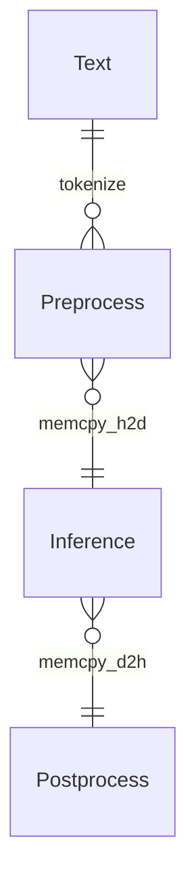

<p align="center">
  <picture>
    <source media="(prefers-color-scheme: dark)" srcset="https://github.com/NLPOptimize/flash-tokenizer/blob/main/assets/FlashTokenizer_main_dark.png?raw=true">
    
  </picture>
</p>
<h1 align="center">
The world's fastest CPU tokenizer library!
</h1>


## EFFICIENT AND OPTIMIZED TOKENIZER ENGINE FOR LLM INFERENCE SERVING

[FlashTokenizer](https://pypi.org/project/flash-tokenizer/)는 **LLM 추론에 사용되는 BertTokenizer를 C++로 고성능 구현한 토크나이저**입니다. [FlashAttention](https://github.com/Dao-AILab/flash-attention)과 [FlashInfer](https://github.com/flashinfer-ai/flashinfer)와 같이 최고의 속도와 정확성을 제공하며, transformers 라이브러리의 `BertTokenizerFast`보다 **10배 더 빠릅니다**.


### [▶️ 성능 비교 데모](https://www.youtube.com/watch?v=a_sTiAXeSE0)


> [!NOTE]  
> ### FlashTokenizer를 사용해야 하는 이유.
> - 많은 개발자들은 [Huggingface의 BertTokenizerFast](https://github.com/huggingface/transformers/blob/main/src/transformers/models/bert/tokenization_bert_fast.py)보다 더 빠르고, 더 정확하며, 사용하기 쉬운 토크나이저가 필요합니다. ([링크1](https://stackoverflow.com/questions/75595699/huggingfaces-berttokenizerfast-is-between-39000-and-258300-times-slower-than-ex), [링크2](https://github.com/PaddlePaddle/PaddleNLP/issues/8565), [링크3](https://blog.csdn.net/xhw205/article/details/129578988))
> - [PaddleNLP의 BertTokenizerFast](https://paddlenlp.readthedocs.io/en/stable/_modules/paddlenlp/experimental/faster_tokenizer.html)는 [Huggingface의 Rust 버전](https://github.com/huggingface/tokenizers)을 `C++`로 구현하여 약 1.2배의 속도 향상을 이루었지만, 이를 사용하려면 매우 무거운 [PaddlePaddle](https://github.com/PaddlePaddle/Paddle)과 [PaddleNLP](https://github.com/PaddlePaddle/PaddleNLP)를 설치해야 합니다.
> - [Tensorflow-text의 FastBertTokenizer](https://www.tensorflow.org/text/api_docs/python/text/FastBertTokenizer)는 오히려 성능이 더 느립니다.
> - [Microsoft의 Blingfire](https://github.com/microsoft/BlingFire)는 custom 데이터를 이용한 빌드에 **8시간 이상이 걸리며**, 상대적으로 정확도가 낮습니다.
> - [Rapid의 cuDF](https://github.com/rapidsai/cudf)는 GPU 기반의 BertTokenizer를 제공하지만 정확도의 문제를 겪고 있습니다.
> - 또한, 안타깝게도, `C#`으로 개발된 [FastBertTokenizer](https://github.com/georg-jung/FastBertTokenizer)와 [BertTokenizers](https://github.com/NMZivkovic/BertTokenizers)는 `Python` 환경에서는 사용할 수 없습니다.
> 
> - 그래서  **FlashTokenizer**를 개발했습니다. 이 토크나이저는 간단히 `pip`으로 설치할 수 있고, **유지보수가 쉬운 C++로 개발**되었으며 매우 빠른 속도를 보장합니다. 이는 Blingfire보다 빠르고 사용하기 편리하게 바로 사용할 수 있습니다.. FlashTokenizer는 [Fast WordPiece Tokenization](https://arxiv.org/abs/2012.15524) 논문에서 제안된 **LinMax Tokenizer**를 사용하여 선형 시간에 토큰화를 수행합니다. 또한 C++ 수준에서 **병렬 처리로 batch encoding을 지원**하여 뛰어난 성능을 제공합니다.


<p align="center">
  <picture>
    <source media="(prefers-color-scheme: dark)" srcset="https://github.com/NLPOptimize/flash-tokenizer/blob/main/assets/Banner_dark.png?raw=true">
    
  </picture>
</p>


<p>


</p><br>

* * *

### FlashTokenizer의 핵심 기능은 다음과 같습니다.

> [!TIP]
> 
> * C++17로 구현되었습니다.
>   * **MacOS**: `clang++`
>   * **Windows**: `Visual Studio 2022`
>   * **Ubuntu**: `g++`
> 
> * pybind11을 통해 Python에서도 동일하게 빠른 속도를 제공합니다.
> * OPENMP를 활용하여 C++ 수준에서 병렬 처리를 지원합니다.


## 뉴스

> [!IMPORTANT]  
> **[2025년 4월 2일]**
> - 성능 벤치마크 코드를 추가했습니다.
> - 성능 벤치마크는 Python으로 수행되며, 필요한 패키지는 [setup.sh](./perftest/setup.sh)를 통해 설치할 수 있습니다.
> - `BasicTokenizer`에 `tokenize_early_stop` 기능을 추가하여 소폭 성능이 향상되었습니다.
> - Windows, Linux, macOS 환경 모두에서 [OpenMP](https://www.openmp.org/)가 `std::thread`보다 우수한 성능을 보여 OpenMP로 전부 전환했습니다.
>
> **[2025년 3월 31일]**
> - 각 운영체제(OS)별로 미리 빌드된 whl 파일을 제공하도록 수정했습니다.
>
> **[2025년 3월 22일]**
> - AC Trie에 [DFA](https://blog.cloudflare.com/pt-br/making-waf-ai-models-go-brr/#:~:text=We%20can%20also%20tune%20Aho,settings%20based%20on%20this%20recommendation)를 추가했습니다.
>
> **[2025년 3월 21일]**
> - 토크나이저 정확도를 개선했습니다.
>
> **[2025년 3월 19일]** 
> - [Aho–Corasick 알고리즘](https://en.wikipedia.org/wiki/Aho%E2%80%93Corasick_algorithm)을 이용한 LinMaxMatching 기법 적용으로 메모리 사용량을 줄이고 성능을 개선했습니다.
> - 모든 함수의 브랜치 파이프라이닝(branch pipelining)을 개선하고, 강제로 인라인(force-inline)을 적용했습니다.
> - `WordpieceTokenizer(Backward)`의 불필요한 연산을 제거했습니다.
> - [Bloom filter](https://en.wikipedia.org/wiki/Bloom_filter)를 제외하고는 캐싱보다 빠르도록 모든 함수를 최적화했습니다.
> - `punctuation`, `control`, `whitespace`를 미리 constexpr로 정의하고 블룸 필터로 사용합니다.
> - 메모리 프로파일링을 통해 불필요한 메모리 할당을 줄였습니다.
> - ✨FlashTokenizer✨는 `bert-base-uncased` 모델 기준 단일 코어에서 초당 약 **35,000개의 텍스트**를 처리할 수 있으며, 텍스트 하나당 약 **28ns**의 처리 속도를 달성했습니다.
>
> **[2025년 3월 18일]**
> - BasicTokenizer의 정확도가 향상되어 전체적인 토크나이저 정확도가 개선되었으며, 특히 유니코드 입력에 대해 더 정확한 결과를 제공합니다.
>
> **[2025년 3월 14일]**
> - [Fast WordPiece Tokenization](https://arxiv.org/abs/2012.15524) 논문에서 소개된 [Trie](https://en.wikipedia.org/wiki/Trie)를 사용하여 `WordPieceTokenizer`와 `WordPieceBackwardTokenizer`의 성능을 개선했습니다.
> - SingleEncoding에서는 `std::list`에 `FastPoolAllocator`를 적용하여 성능을 높였으나, 이는 thread-safe 하지 않아 BatchEncoding에서는 일반 `std::list<std::string>`을 그대로 사용합니다. BatchEncoding에서는 `OPENMP`를 완전히 제거하고 오직 `std::thread`만 사용했습니다.
>
> **[2025년 3월 10일]**
> - robin_hood를 활용한 빠른 토큰 매핑과 메모리 복사를 최소화한 `std::list`를 통해 성능이 향상되었습니다.
>
> #### 토큰 ID 맵 테이블 성능 테스트
> - 토큰 및 ID 매핑에는 가장 빠른 성능을 보인 `robin_hood::unordered_flat_map<std::string, int>`을 사용합니다.
>
> **[2025년 3월 9일]** BertTokenizer를 위한 flash-tokenizer 개발이 완료되었습니다.
>

## 1. 설치

### 요구 사항
 * `Windows(AMD64)`, `MacOS(ARM64)`, `Ubuntu(x86-64)` .
 * `g++` / `clang++` / `MSVC`.
 * `python 3.8 ~ 3.13`.

### [PIP](https://pypi.org/project/flash-tokenizer/) 으로 설치하기.


Windows에서는  [vc_redist.x64.exe](https://github.com/NLPOptimize/flash-tokenizer/releases/download/Packages/VC_redist.x64.exe) 가 필요합니다.

```bash
# Windows
pip install -U flash-tokenizer
```
```bash
# Linux
pip install -U flash-tokenizer
```
```bash
# MacOS
pip install -U flash-tokenizer
```

### Source에서 직접 빌드하기.
```bash
git clone https://github.com/NLPOptimize/flash-tokenizer
cd flash-tokenizer/prj
pip install .
```


## 2. 예제

```python
from flash_tokenizer import BertTokenizerFlash
from transformers import BertTokenizer

titles = [
    '绝不能放弃，世界上没有失败，只有放弃。',
    'is there any doubt about it "None whatsoever"',
    "세상 어떤 짐승이 이를 드러내고 사냥을 해? 약한 짐승이나 몸을 부풀리지, 진짜 짐승은 누구보다 침착하지.",
    'そのように二番目に死を偽装して生き残るようになったイタドリがどうして初めて見る自分をこんなに気遣ってくれるのかと尋ねると「私が大切にする人たちがあなたを大切にするから」と答えては'
]

tokenizer1 = BertTokenizerFlash.from_pretrained('bert-base-multilingual-cased')
tokenizer2 = BertTokenizer.from_pretrained('bert-base-multilingual-cased')

correct = 0
for title in titles:
    print(title)
    tokens1 = tokenizer1.tokenize(title)
    tokens2 = tokenizer2.tokenize(title)
    ids1 = tokenizer1(title, max_length=512, padding="longest").input_ids[0]
    ids2 = tokenizer2(title, max_length=512, padding="longest", return_tensors="np").input_ids[0].tolist()
    if tokens1 == tokens2 and ids1 == ids2:
        correct += 1
        print("Accept!")
    else:
        print("Wrong Answer")
    print(ids1)
    print(ids2)
    print()

print(f'Accuracy: {correct * 100.0 / len(titles):.2f}%')
```


```
绝不能放弃，世界上没有失败，只有放弃。
Accept!
[101, 6346, 2080, 6546, 4284, 3704, 10064, 2087, 5621, 2078, 4917, 4461, 3204, 7480, 10064, 2751, 4461, 4284, 3704, 1882, 102]
[101, 6346, 2080, 6546, 4284, 3704, 10064, 2087, 5621, 2078, 4917, 4461, 3204, 7480, 10064, 2751, 4461, 4284, 3704, 1882, 102]

is there any doubt about it "None whatsoever"
Accept!
[101, 10124, 11155, 11178, 86697, 10978, 10271, 107, 86481, 12976, 11669, 23433, 107, 102]
[101, 10124, 11155, 11178, 86697, 10978, 10271, 107, 86481, 12976, 11669, 23433, 107, 102]

세상 어떤 짐승이 이를 드러내고 사냥을 해? 약한 짐승이나 몸을 부풀리지, 진짜 짐승은 누구보다 침착하지.
Accept!
[101, 9435, 14871, 55910, 9710, 48210, 10739, 35756, 9113, 30873, 31605, 11664, 9405, 118729, 10622, 9960, 136, 9539, 11102, 9710, 48210, 43739, 9288, 10622, 9365, 119407, 12692, 12508, 117, 9708, 119235, 9710, 48210, 10892, 9032, 17196, 80001, 9783, 119248, 23665, 119, 102]
[101, 9435, 14871, 55910, 9710, 48210, 10739, 35756, 9113, 30873, 31605, 11664, 9405, 118729, 10622, 9960, 136, 9539, 11102, 9710, 48210, 43739, 9288, 10622, 9365, 119407, 12692, 12508, 117, 9708, 119235, 9710, 48210, 10892, 9032, 17196, 80001, 9783, 119248, 23665, 119, 102]

そのように二番目に死を偽装して生き残るようになったイタドリがどうして初めて見る自分をこんなに気遣ってくれるのかと尋ねると「私が大切にする人たちがあなたを大切にするから」と答えては
Accept!
[101, 11332, 24273, 2150, 5632, 5755, 1943, 4805, 1980, 2371, 7104, 11592, 5600, 1913, 4814, 1975, 27969, 15970, 21462, 15713, 21612, 10898, 56910, 22526, 22267, 2547, 19945, 7143, 1975, 6621, 2534, 1980, 28442, 60907, 11312, 4854, 7770, 14813, 18825, 58174, 75191, 11662, 3456, 1945, 100812, 1890, 5949, 1912, 3197, 2535, 84543, 2179, 78776, 111787, 22946, 20058, 11377, 3197, 2535, 84543, 16867, 1891, 1940, 6076, 27144, 11588, 102]
[101, 11332, 24273, 2150, 5632, 5755, 1943, 4805, 1980, 2371, 7104, 11592, 5600, 1913, 4814, 1975, 27969, 15970, 21462, 15713, 21612, 10898, 56910, 22526, 22267, 2547, 19945, 7143, 1975, 6621, 2534, 1980, 28442, 60907, 11312, 4854, 7770, 14813, 18825, 58174, 75191, 11662, 3456, 1945, 100812, 1890, 5949, 1912, 3197, 2535, 84543, 2179, 78776, 111787, 22946, 20058, 11377, 3197, 2535, 84543, 16867, 1891, 1940, 6076, 27144, 11588, 102]

Accuracy: 100.00%
```

## 3. 다른 구현체들.


<p align="center">
  <picture>
    <source media="(prefers-color-scheme: dark)" srcset="./assets/logos_dark.png">
    
  </picture>
</p>


대부분의 [BERT](https://arxiv.org/abs/1810.04805) 기반 모델들은 [WordPiece 토크나이저](https://static.googleusercontent.com/media/research.google.com/ja//pubs/archive/37842.pdf)를 사용하는데, 그 코드는 [여기](https://github.com/google-research/bert/blob/master/tokenization.py)에서 확인할 수 있습니다. (Huggingface의 간단한 구현체는 [여기](https://github.com/huggingface/transformers/blob/main/src/transformers/models/bert/tokenization_bert.py)에서 볼 수 있습니다.)

BertTokenizer는 CPU 연산량이 많기 때문에 추론 단계에서 병목이 될 수 있으며, 최적화되지 않은 토크나이저는 매우 느릴 수 있습니다. 대표적인 사례로 [KR-BERT](https://arxiv.org/abs/2008.03979)에서 소개된 [BidirectionalWordpieceTokenizer](https://github.com/snunlp/KR-BERT/blob/master/krbert_tensorflow/tokenization_ranked.py)가 있습니다. 이 토크나이저의 대부분 코드는 기존과 같지만, 하위 토큰(sub token)을 역방향으로 탐색하며, 정방향 탐색에 비해 더 큰 값을 기록합니다. 논문에서는 이를 통해 정확도가 개선된다고 주장하지만, 다른 정량적 지표를 찾기는 어렵고, 실제 정확도의 개선도 크지 않은 반면 토크나이저의 속도가 심각하게 느려집니다.

다음은 주요 토크나이저의 구현 방식입니다:

- transformers (Rust 구현체, PyO3 사용)
- paddlenlp (C++ 구현체, pybind 사용)
- tensorflow-text (C++ 구현체, pybind 사용)
- blingfire (C++ 구현체, 네이티브 바이너리 호출)

대부분의 개발자는 보통 `transformers.BertTokenizer` 또는 `transformers.AutoTokenizer`를 사용할 텐데, 이때 `AutoTokenizer`를 사용하면 실제로는 `transformers.BertTokenizerFast`가 반환됩니다.

이는 당연히 기존 BertTokenizer보다 빠르지만, 결과가 정확히 일치하지는 않습니다. 즉, 토크나이저부터 이미 100%의 정확도를 포기하게 되는 것입니다.

BertTokenizer는 transformers 외에도 [PaddleNLP](https://github.com/PaddlePaddle/PaddleNLP)와 [tensorflow-text](https://www.tensorflow.org/text)에서도 제공됩니다.

한편 [Blingfire](https://github.com/microsoft/BlingFire)는 마이크로소프트가 개발했으나 현재는 유지보수가 중단된 상태입니다.

PaddleNLP는 PaddlePaddle이 필요하며, 3.0rc 버전부터 토크나이저 기능을 제공합니다. 설치는 다음과 같이 할 수 있습니다.

```bash
##### Install PaddlePaddle, PaddleNLP
python -m pip install paddlepaddle==3.0.0b1 -i https://www.paddlepaddle.org.cn/packages/stable/cpu/
pip install --upgrade paddlenlp==3.0.0b3
##### Install transformers
pip install transformers==4.47.1
##### Install tf-text
pip install tensorflow-text==2.18.1
##### Install blingfire
pip install blingfire
```

blingfire를 제외하면, 대부분의 BertTokenizer 구현체는 `vocab.txt`만 있으면 즉시 tokenizer를 실행할 수 있습니다.  
(blingfire 역시 `vocab.txt`만 있으면 되지만, 이를 사용하기 위한 사전 학습 과정이 약 8시간 필요합니다.)

자세히 살펴볼 구현체는 `PaddleNLP의 BertTokenizerFast`와 `blingfire`입니다.

- **blingfire**: [결정적 유한 상태 머신(DFSM)](https://github.com/microsoft/BlingFire/blob/master/doc/Bling_Fire_Tokenizer_Algorithms.pdf)을 활용하여 선형 탐색을 한 번으로 줄이고 불필요한 비교 연산을 제거해, O(n)의 우수한 시간 복잡도를 달성했습니다.
  - **장점**: 다른 구현체보다 **5~10배 빠른 속도**.
  - **단점**: 긴 학습 시간(약 8시간)이 필요하고, 정확도가 상대적으로 낮습니다.  
    (사실상 개발이 중단되어 도움을 얻기 어렵습니다.)

- **PaddleNLP**: 아래의 실험에서 확인할 수 있듯이, PaddleNLP는 Huggingface의 BertTokenizerFast보다 언제나 더 빠른 성능을 보이며, 소수점 단위로 비교해도 일관되게 우수한 속도를 보입니다. 이는 X86이나 Arm 등 OS와 상관없이 동일합니다.
  - **장점**: 내부적으로 **C++로 구현**되어 있어 Rust로 구현된 Huggingface의 `transformers.BertTokenizerFast`보다 1.2배 빠르면서도 결과 값은 완벽하게 일치합니다.
    - 다만 `return_tensors` 옵션에서 PyTorch 텐서(`pt`)를 직접 지정할 수 없지만, 큰 문제는 아닙니니다.
  - **단점**: PaddlePaddle과 PaddleNLP 패키지를 설치해야 한다는 점 외에는 없습니다.

## 4. 성능 평가


### 4.1 성능 측정 (Single text encoding)

Acc
  <picture>
    <source media="(prefers-color-scheme: dark)" srcset="./assets/comp_speed_dark.png">
    
  </picture>
</p>

<p align="center">
  <picture>
    <source media="(prefers-color-scheme: dark)" srcset="./assets/comp_accuracy_dark.png">
    
  </picture>
</p>


### Tokenizer 성능 비교 표

Accuracy 는 [Google의 BertTokenizerFast](https://github.com/google-research/bert/blob/master/tokenization.py)를 기준으로 측정한 결과입니다. 만약 단 하나의 `input_ids` 값이라도 기준과 일치하지 않으면, 해당 결과는 오답으로 간주됩니다.

#### [google-bert/bert-base-cased](https://huggingface.co/google-bert/bert-base-cased)

| Tokenizer                      | Elapsed Time | texts     | Accuracy |
|--------------------------------|----------------:|-----------:|------------:|
| BertTokenizerFast(Huggingface) | 84.3700s     | 1,000,000 | 99.9226% |
| BertTokenizerFast(PaddleNLP)   | 75.6551s     | 1,000,000 | 99.9226% |
| FastBertTokenizer(Tensorflow)  | 219.1259s    | 1,000,000 | 99.9160% |
| Blingfire                      | 13.6183s     | 1,000,000 | 99.8991% |
| **FlashBertTokenizer**             | 8.1968s      | 1,000,000 | 99.8216% |

#### [google-bert/bert-base-uncased](https://huggingface.co/google-bert/bert-base-uncased)

| Tokenizer                      |   Elapsed Time |     texts |   Accuracy |
|--------------------------------|----------------:|-----------:|------------:|
| BertTokenizerFast(Huggingface) |       91.7882s | 1,000,000 |   99.9326% |
| BertTokenizerFast(PaddleNLP)   |       83.6839s | 1,000,000 |   99.9326% |
| FastBertTokenizer(Tensorflow)  |      204.2240s | 1,000,000 |   99.1379% |
| Blingfire                      |       13.2374s | 1,000,000 |   99.8588% |
| **FlashBertTokenizer**             |        7.6313s | 1,000,000 |   99.6884% |

#### [google-bert/bert-base-multilingual-cased](https://huggingface.co/google-bert/bert-base-multilingual-cased)


| Tokenizer                      | Elapsed Time | texts     | Accuracy |
|--------------------------------|----------------:|-----------:|------------:|
| BertTokenizerFast(Huggingface) | 212.1570s    | 2,000,000 | 99.7964% |
| BertTokenizerFast(PaddleNLP)   | 193.9921s    | 2,000,000 | 99.7964% |
| FastBertTokenizer(Tensorflow)  | 394.1574s    | 2,000,000 | 99.7892% |
| Blingfire                      | 38.9013s     | 2,000,000 | 99.9780% |
| **FlashBertTokenizer**             | 20.4570s     | 2,000,000 | 99.8970% |


#### [beomi/kcbert-base](https://github.com/Beomi/KcBERT)

| Tokenizer                      |   Elapsed Time |     texts |   Accuracy |
|--------------------------------|----------------:|-----------:|------------:|
| BertTokenizerFast(Huggingface) |       52.5744s | 1,000,000 |   99.6754% |
| BertTokenizerFast(PaddleNLP)   |       44.8943s | 1,000,000 |   99.6754% |
| FastBertTokenizer(Tensorflow)  |      198.0270s | 1,000,000 |   99.6639% |
| Blingfire                      |       13.0701s | 1,000,000 |   99.9434% |
| **FlashBertTokenizer**             |        5.2601s | 1,000,000 |   99.9484% |


| Tokenizer                      |   Elapsed Time |     texts |   Accuracy |
|--------------------------------|----------------|-----------|------------|
| **FlashBertTokenizer**             |        5.1875s | 1,000,001 |   99.9484% |
| Blingfire                      |       13.2783s | 1,000,001 |   99.9435% |
| rust_tokenizers(guillaume-be)  |       16.6308s | 1,000,001 |   99.9829% |
| BertTokenizerFast(PaddleNLP)   |       44.5476s | 1,000,001 |   99.6754% |
| BertTokenizerFast(Huggingface) |       53.2525s | 1,000,001 |   99.6754% |
| FastBertTokenizer(Tensorflow)  |      202.1633s | 1,000,001 |   99.6639% |

#### [microsoft/llmlingua-2-bert-base-multilingual-cased-meetingbank](https://huggingface.co/microsoft/llmlingua-2-bert-base-multilingual-cased-meetingbank)

| Tokenizer                      |   Elapsed Time |     texts |   Accuracy |
|--------------------------------|----------------:|-----------:|------------:|
| BertTokenizerFast(Huggingface) |      208.8858s | 2,000,000 |   99.7964% |
| BertTokenizerFast(PaddleNLP)   |      192.6593s | 2,000,000 |   99.7964% |
| FastBertTokenizer(Tensorflow)  |      413.2010s | 2,000,000 |   99.7892% |
| Blingfire                      |       39.3765s | 2,000,000 |   99.9780% |
| **FlashBertTokenizer**             |       22.8820s | 2,000,000 |   99.8970% |

| Tokenizer                      |   Elapsed Time |     texts |   Accuracy |
|--------------------------------|----------------|-----------|------------|
| **FlashBertTokenizer**             |       22.0901s | 2,000,001 |   99.8971% |
| Blingfire                      |       37.9836s | 2,000,001 |   99.9780% |
| rust_tokenizers(guillaume-be)  |       98.0366s | 2,000,001 |   99.9976% |
| BertTokenizerFast(PaddleNLP)   |      208.6889s | 2,000,001 |   99.7964% |
| BertTokenizerFast(Huggingface) |      219.2644s | 2,000,001 |   99.7964% |
| FastBertTokenizer(Tensorflow)  |      413.9725s | 2,000,001 |   99.7892% |

#### [KR-BERT](https://github.com/snunlp/KR-BERT)


| Tokenizer                                    |   Elapsed Time |     texts |   Accuracy |
|--------------------------------|----------------:|-----------:|------------:|
| BertTokenizerBidirectional(KR-BERT Original) |      128.3320s | 1,000,000 |  100.0000% |
| **FlashBertTokenizer(Bidirectional)**                           |       10.4492s | 1,000,000 |   99.9631% |





## 6. 호환성

FlashBertTokenizer는 어떤 프레임워크와도 함께 사용할 수 있습니다. LLM의 빠른 추론을 위해서는 각 프레임워크의 CUDA 버전 호환성도 중요합니다.

- [PyTorch](https://pytorch.org/)는 더 이상 conda를 통한 설치를 지원하지 않습니다.
- [ONNXRUNTIME](https://onnxruntime.ai/docs/execution-providers/CUDA-ExecutionProvider.html#cuda-12x)은 CUDA 버전별로 나뉘어 제공됩니다.
- PyTorch 역시 CUDA 12.x를 지원하지 않고 최신 버전인 CUDA 12.8로 이동하려고 하고 있지만, 현재 프레임워크 전반의 추세는 CUDA 11.8을 유지하는 방향입니다.
  - CUDA 12.x는 최신 GPU인 Hopper와 Blackwell에 최적화되어 있으며, Volta와 같은 GPU에서는 CUDA 11.8이 CUDA 12.x보다 더 빠릅니다.


| DL Framework | Version | OS   | CPU  | CUDA 11.8 | CUDA 12.3 | CUDA 12.4 | CUDA 12.6 | CUDA 12.8 |
| ------------ | ----|---- | ---- | --------- | ----|----- | --------- | --------- |
| PyTorch | 2.6| Linux, Windows | ⚪|⚪|❌|⚪| ⚪ |    ❌      |
| PyTorch | 2.7|Linux, Windows|⚪|⚪|❌|❌|⚪|⚪|
| ONNXRUNTIME(11) | 1.20.x| Linux, Windows|⚪|⚪|❌|❌|❌|❌|
| ONNXRUNTIME(12) | 1.20.x| Linux, Windows|⚪|❌|⚪|⚪|⚪|⚪|
| PaddlePaddle | 3.0-beta | Linux, Windows|⚪|⚪|❌|❌|❌|❌|


## 7. GPU 기반 토크나이저

다음은 [Run State of the Art NLP Workloads at Scale with RAPIDS, HuggingFace, and Dask](https://developer.nvidia.com/blog/run-state-of-the-art-nlp-workloads-at-scale-with-rapids-huggingface-and-dask/#:~:text=,and%20then%20used%20in%20subsequent)에서 설명하는 cuDF의 설치 및 사용 예제입니다. *(매우 빠른 속도를 보입니다)*

WordPiece Tokenizer를 GPU에서 [RAPIDS(cuDF)](https://docs.rapids.ai/)를 이용하여 실행할 수 있습니다.

- [구현체 코드](https://github.com/rapidsai/cudf/blob/0e99ec3ec15b8b0ebe68bd884c7d22d600e9259e/python/cudf/cudf/core/wordpiece_tokenize.py#L10)
- [사용 예제](https://github.com/rapidsai/cudf/blob/0e99ec3ec15b8b0ebe68bd884c7d22d600e9259e/python/cudf/cudf/tests/text/test_subword_tokenizer.py#L244)

[RAPIDS 설치 방법](https://docs.rapids.ai/install/)에서 볼 수 있듯이, Linux만 지원하며, CUDA 버전도 다른 프레임워크들과 호환되지 않습니다. 따라서 최적의 선택은 [docker](https://hub.docker.com/r/rapidsai/base)를 사용하는 것이며, GPU를 통한 배치(batch) 처리에서는 CPU보다 빠르지만, 스트리밍(streaming) 처리에서는 오히려 CPU보다 느립니다.

해당 [블로그](https://developer.nvidia.com/blog/run-state-of-the-art-nlp-workloads-at-scale-with-rapids-huggingface-and-dask/#:~:text=,and then used in subsequent)에는 좋은 예제 코드와 설명이 제공됩니다. cuDF를 사용하려면 먼저 `vocab.txt`를 다음과 같이 [hash_vocab](https://github.com/rapidsai/cudf/blob/branch-25.06/python/cudf/cudf/utils/hash_vocab_utils.py)으로 변환해야 합니다. 문제는 이 hash_vocab 함수가 다국어(multilingual)를 지원하지 않는다는 점입니다. 따라서 영어와 중국어 외의 다른 언어가 포함된 vocab을 사용하는 경우, cuDF의 WordpieceTokenizer를 사용할 수 없습니다.

```python
import cudf
from cudf.utils.hash_vocab_utils import hash_vocab
hash_vocab('bert-base-cased-vocab.txt', 'voc_hash.txt')
```


## TODO

- [x] [BidirectionalWordPieceTokenizer](https://github.com/snunlp/KR-BERT/blob/master/krbert_tensorflow/tokenization_ranked.py)
- [x] BatchEncoder with Multithreading. 
- [x] Replace `std::list` to `boost::intrusive::list`.
- [x] ~~[MaxMatch-Dropout: Subword Regularization for WordPiece](https://arxiv.org/abs/2209.04126) Option.~~
- [x] Use stack memory for reduce memory allocation. (C-Style, [alloca](https://man7.org/linux/man-pages/man3/alloca.3.html), [_alloca](https://learn.microsoft.com/ko-kr/cpp/c-runtime-library/reference/alloca?view=msvc-170))
- [x] ~~Support for parallel processing option for single encode.~~
- [ ] `circle.ai`
  - [ ] Implement distribution of compiled wheel packages for installation.
- [ ] SIMD
- [ ] ~~CUDA Version.~~


## 감사의 말

FlashTokenizer는 [FlashAttention](https://github.com/Dao-AILab/flash-attention), [FlashInfer](https://github.com/flashinfer-ai/flashinfer), [FastBertTokenizer](https://github.com/georg-jung/FastBertTokenizer), [tokenizers-cpp](https://github.com/mlc-ai/tokenizers-cpp) 프로젝트에서 영감을 얻어 개발되었습니다.


## 성능 비교

* **WordPiece**
  * 📒 [huggingface/tokenizers (Rust)](https://github.com/huggingface/tokenizers)
    * transformers.BertTokenizerFast의 Rust 구현체로, 파이썬 패키지로 제공됩니다.
    * 🔵 **pip으로 설치 가능**
  * 🔥 [FastBertTokenizer (C#)](https://fastberttokenizer.gjung.com)
    * 매우 빠른 성능을 보이지만, 영어가 아닌 입력에서는 정확도가 크게 떨어집니다.
  * ❌ [BertTokenizers (C#)](https://github.com/NMZivkovic/BertTokenizers)
    * [FastBertTokenizer (C#) VS BertTokenizers (C#)](https://github.com/georg-jung/FastBertTokenizer/tree/master?tab=readme-ov-file#comparison-to-berttokenizers) 비교 결과, `FastBertTokenizer(C#)`가 더 빠른 것으로 확인됩니다.
  * 🔥 [rust-tokenizers (Rust)](https://github.com/guillaume-be/rust-tokenizers)
    * BertTokenizerFlash와 Blingfire보다는 느리지만, 다른 구현체보다는 빠르고 정확합니다.
    * 🔵 **pip으로 설치 가능**
  * ❌ [tokenizers-cpp (C++)](https://github.com/mlc-ai/tokenizers-cpp)
    * SentencePiece 및 HuggingFace의 Rust 구현체를 래핑한 형태로, 독자적인 성능 측정은 의미가 없습니다.
  * ❌ [bertTokenizer (Java)](https://github.com/ankiteciitkgp/bertTokenizer)
    * Java 구현체는 취급하지 않습니다.
  * ✅ [ZhuoruLin/fast-wordpiece (Rust)](https://github.com/ZhuoruLin/fast-wordpiece)
    * LinMaxMatching 알고리즘을 사용한 Rust 구현체로, Rust 환경에서만 실행 가능하며, C++ 구현체보다 빠르지는 않을 것으로 예상됩니다.
  * ❌ [huggingface_tokenizer_cpp (C++)](https://github.com/Sorrow321/huggingface_tokenizer_cpp)
    * 단순한 C++ 구현 방식으로 인해 매우 느립니다.
  * ❌ [SeanLee97/BertWordPieceTokenizer.jl (Julia)](https://github.com/SeanLee97/BertWordPieceTokenizer.jl)
    * Julia 구현체는 취급하지 않습니다.

* **BPE**
  * https://github.com/openai/tiktoken

* **SentencePiece**
  * [google/sentencepiece (C++)](https://github.com/google/sentencepiece)


## ⭐ 기록

<a href="https://www.star-history.com/#NLPOptimize/flash-tokenizer&Date">

 <picture>
   <source media="(prefers-color-scheme: dark)" srcset="https://api.star-history.com/svg?repos=NLPOptimize/flash-tokenizer&type=Date&theme=dark" />
   <source media="(prefers-color-scheme: light)" srcset="https://api.star-history.com/svg?repos=NLPOptimize/flash-tokenizer&type=Date" />
   
 </picture>
</a>


## 참고

* https://medium.com/@techhara/which-bert-tokenizer-is-faster-b832aa978b46
* https://medium.com/@atharv6f_47401/wordpiece-tokenization-a-bpe-variant-73cc48865cbf
* https://www.restack.io/p/transformer-models-bert-answer-fast-berttokenizerfast-cat-ai
* https://medium.com/@anmolkohli/my-notes-on-bert-tokenizer-and-model-98dc22d0b64
* https://nocomplexity.com/documents/fossml/nlpframeworks.html
* https://github.com/martinus/robin-hood-hashing
* https://arxiv.org/abs/2012.15524
* https://github.com/google/highway
