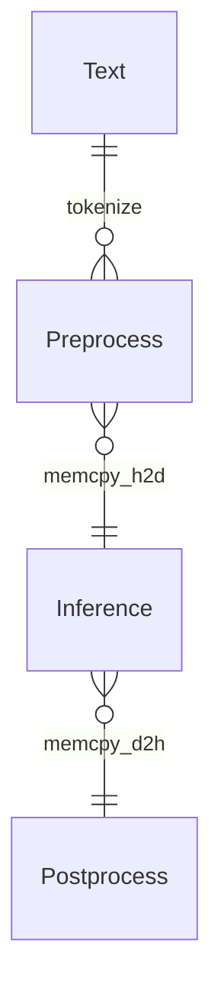

<p align="center">
  <picture>
    <source media="(prefers-color-scheme: dark)" srcset="https://github.com/NLPOptimize/flash-tokenizer/blob/main/assets/FlashTokenizer_main_dark.png?raw=true">
    
  </picture>
</p>
<h1 align="center">
Tokenizer Library for LLM Serving
</h1>


## EFFICIENT AND OPTIMIZED TOKENIZER ENGINE FOR LLM INFERENCE SERVING


FlashTokenizer is a high-performance tokenizer implementation in C++ of the BertTokenizer used for LLM inference. It has the highest speed and accuracy of any tokenizer, such as [FlashAttention](https://github.com/Dao-AILab/flash-attention) and [FlashInfer](https://github.com/flashinfer-ai/flashinfer), and is 4-5 times faster than BertTokenizerFast in transformers.

> [!NOTE]  
> `FlashBertTokenizer` is 4x faster than `transformers.BertTokenizerFast` and 15.5x faster than `transformers.BertTokenizer`.


<p align="center">
  <picture>
    <source media="(prefers-color-scheme: dark)" srcset="https://github.com/NLPOptimize/flash-tokenizer/blob/main/assets/Banner_dark.png?raw=true">
    
  </picture>
</p>


<p>


</p><br>

* * *

### FlashTokenizer includes the following core features

> [!TIP]
> 
>  * Implemented in C++17 and is fastest when built with GNUC.
>     * MacOS: `g++(14.2.0)` is faster than `clang++(16.0.0)`.
>     * Windows: `g++(8.1.0)-MinGW64` is faster than `Visual Studio 2019`.
>     * Ubuntu: `g++(11.4.0)` is faster than `clang++(14.0.0)`. 
>
> * Equally fast in Python via pybind11.
> * Blingfire was difficult to use in practice due to its low accuracy, but FlashBertTokenizer has both high accuracy and high speed.
> * Although it's only implemented as a single thread, it's capable of 40K RPS in C++ and 25K RPS in Python, and it's thread-safe, so you can go even faster with multi-threading if you need to.


## News

> [!IMPORTANT]  
> [Mar 10 2025] Performance improvements through faster token mapping with robin_hood and memory copy minimization with **std::list**.
>
> | Container   | Elapsed Time | Max RPS | Description                                                  |
> | ----------- | ------------ | ------- | ------------------------------------------------------------ |
>| std::list   | 10.3458      | 39660.5 | When combining containers, std::list is the fastest because it doesn't allocate extra memory and just appends to the end. |
> | std::deque  | 15.3494      | 26473.1 | Because it is organized in chunks, it requires memory allocation even when combining containers and has the slowest performance due to its low cache hit rather than contiguous memory. |
> | std::vector | 11.9718      | 33913.3 | It allocates new memory each time when combining containers, but it has a high cache hit for fast performance. |
> 
> #### Token Ids Map Table Performance Test.
> 
>Token and Ids Map used the fastest unordered_flat_map as shown in the test results below.
> 
>| Map                                                | Elapsed Time(Access) |
> | -------------------------------------------------- | -------------------- |
>| ✅ robin_hood::unordered_flat_map<std::string, int> | 0.914775             |
> | robin_hood::unordered_node_map<std::string, int>   | 0.961003             |
>| robin_hood::unordered_map<std::string, int>        | 0.917136             |
> | std::unordered_map<std::string, int, XXHash>       | 1.1506               |
> | std::unordered_map<std::string, int>               | 1.20015              |
> 
> XXHash is implemented as follows.
> 
> ```c++
> #define XXH_STATIC_LINKING_ONLY
>#define XXH_INLINE_ALL
> #include "xxhash.h"
>struct XXHash {
> size_t operator()(const std::string &s) const {
>      return XXH3_64bits(s.data(), s.size());
>  }
> };
>  ```
>    
>    
>    
> [Mar 09 2025] Completed development of flash-tokenizer for BertTokenizer.


## 1. Installation

### Requirements

 * g++ / clang++ / MSVC
 * python3.9 ~ 3.13

### Install from [PIP](https://pypi.org/project/flash-tokenizer/)
```bash
pip install -U flash-tokenizer
```

### Install from Source
```bash
git clone https://github.com/NLPOptimize/flash-tokenizer
cd flash-tokenizer
pip install -r requirements.txt
python -m build # `*.whl` file will be created in the `dist` folder.
```


## 2. Usage

```python
from flash_tokenizer import FlashBertTokenizer
tokenizer = FlashBertTokenizer("path/to/vocab.txt", do_lower_case=True)
# Tokenize text
ids = tokenizer("Hello, world!")
print(ids)
```

## 3. Other Implementations


<p>


</p>


Most [BERT](https://arxiv.org/abs/1810.04805)-based models use the [WordPiece Tokenizer](https://static.googleusercontent.com/media/research.google.com/ja//pubs/archive/37842.pdf), whose code can be found [here](https://github.com/google-research/bert/blob/master/tokenization.py).
(A simple implementation of Huggingface can be found [here](https://github.com/huggingface/transformers/blob/main/src/transformers/models/bert/tokenization_bert.py)).

Since the BertTokenizer is a CPU intensive algorithm, inference can be a bottleneck, and unoptimized tokenizers can be severely slow. A good example is the [BidirectionalWordpieceTokenizer](https://github.com/snunlp/KR-BERT/blob/master/krbert_tensorflow/tokenization_ranked.py) introduced in [KR-BERT](https://arxiv.org/abs/2008.03979). Most of the code is the same, but the algorithm traverses the sub token backwards and writes a larger value compared to the forward traversal. The paper claims accuracy improvements, but it's hard to find other quantitative metrics, and the accuracy improvements aren't significant, and the tokenizer is seriously slowed down.

* transformers (Rust Impl, PyO3)
* paddlenlp (C++ Impl, pybind)
* tensorflow-text (C++ Impl, pybind)
* blingfire (C++ Impl, Native binary call)

Most developers will either use `transformers.BertTokenizer` or `transformers.AutoTokenizer`, but using `AutoTokenizer` will return `transformers.BertTokenizerFast`.

Naturally, it's faster than BertTokenizer, but the results aren't exactly the same, which means you're already giving up 100% accuracy starting with the tokenizer.

BertTokenizer is not only provided by transformers. [PaddleNLP](https://github.com/PaddlePaddle/PaddleNLP) and [tensorflow-text](https://www.tensorflow.org/text) also provide BertTokenizer.

Then there's [Blingfire](https://github.com/microsoft/BlingFire), which is developed by Microsoft and is being abandoned.

PaddleNLP requires PaddlePaddle and provides tokenizer functionality starting with version 3.0rc. You can install it as follows

```bash
##### Install PaddlePaddle, PaddleNLP
python -m pip install paddlepaddle==3.0.0b1 -i https://www.paddlepaddle.org.cn/packages/stable/cpu/
pip install --upgrade paddlenlp==3.0.0b3
##### Install transformers
pip install transformers==4.47.1
##### Install tf-text
pip install tensorflow-text==2.18.1
##### Install blingfire
pip install blingfire
```


With the exception of blingfire, vocab.txt is all you need to run the tokenizer right away. 
(blingfire also requires only vocab.txt and can be used after 8 hours of learning).

The implementations we'll look at in detail are `PaddleNLP's BertTokenizerFast` and `blingfire`.

* `blingfire`: Uses a [Deterministic Finite State Machine (DFSM)](https://github.com/microsoft/BlingFire/blob/master/doc/Bling_Fire_Tokenizer_Algorithms.pdf) to eliminate one linear scan and unnecessary comparisons, resulting in a time of O(n), which is impressive.
  * **Advantages**: **5-10x faster than other implementations**.
  * **Disadvantages**: Long training time (8 hours) and lower accuracy than other implementations. (+Difficult to get help due to de facto development hiatus).
* `PaddleNLP`: As shown in the experiments below, PaddleNLP is always faster than BertTokenizerFast (HF) to the same number of decimal places, and is always faster on any OS, whether X86 or Arm.
  * **Advantages**:  **Internal implementation is in C++** Compared to `transformers.BertTokenizerFast` implemented in Rust, it is 1.2x faster while outputting exactly the same values.
    * You can't specify `pt(pytorch tensor)` in `return_tensors`, but this is not a problem.[^1]
  * **Disadvantages**: none, other than the need to install PaddlePaddle and PaddleNLP.

## 4. Performance test

### 4.1 Performance test (Batch text encoding)


The graph below compares `transformers.BertTokenizerFast` and `paddlenlp.transformers.bert.tokenizer_fast.BertTokenizerFast` for batch size.

Both libraries are faster to return as `np.ndarray`. Perhaps the implementations have logic to convert to `pt` or `pd` at the end, which takes longer.


<p align="center">
  <picture>
    <source media="(prefers-color-scheme: dark)" srcset="https://github.com/NLPOptimize/flash-tokenizer/blob/main/assets/BatchTest_dark.png?raw=true">
    
  </picture>
</p>


|   BatchSize |   transformers(pt) |   paddlenlp(pd) |   transformers(np) |   paddlenlp(np) |
|-------------|--------------------|-----------------|--------------------|-----------------|
|           1 |           2.32744  |        1.74695  |           1.87685  |        1.56597  |
|           2 |           1.87427  |        1.53865  |           1.50911  |        1.45918  |
|           4 |           1.54254  |        1.13622  |           1.12902  |        1.07593  |
|           8 |           1.25432  |        0.821463 |           0.850269 |        0.798163 |
|          16 |           1.09129  |        0.640243 |           0.67293  |        0.617309 |
|          32 |           0.994335 |        0.528553 |           0.587379 |        0.519887 |
|          64 |           0.971175 |        0.476652 |           0.537753 |        0.471145 |
|         128 |           0.952003 |        0.478113 |           0.531592 |        0.451384 |

[^1]: As you can see in the graph above, returning to `pt(pytorch tensor)'` becomes very slow. 

### 4.2 Performance test (Single text encoding)

Accuracy is the result of measuring `transformers.BertTokenizer` as a baseline. If even one of the `input_ids` is incorrect, the answer is considered incorrect.
Surprisingly, the performance of `tensorflow-text` is much faster than before. However, there is still no advantage for `tensorflow-text' when comparing the four libraries.


### DeepCT (BertTokenizer)
| Tokenizer             | Elapsed Time (s) |   titles | Accuracy (%) |
|-----------------------|----------------|----------|------------|
| BertTokenizer(Huggingface)     |       255.651  |  404,464 |   100 (Baseline)   |
| ✨ **BertTokenizerFlash**    | ~~19.1325~~ ➡️ ~~16.526~~ ➡️ **12.5391**🔺 |  404,464 | ~~99.3248~~ ➡️ 99.8442 🔺 |
| BertTokenizerFast(PP) |        64.6828 |   404,464 |    99.8615 |
| BertTokenizerFast(HF) |        69.6647 |   404,464 |    99.8615 |
| FastBertTokenizer(TF) |        85.5056 |   404,464 |    99.8507 |
| Blingfire             |        12.1941 |   404,464 |    96.8979 |


### DeepCT (BidirectionalBertTokenizer)

| Tokenizer             | Elapsed Time (s) |   titles | Accuracy (%) |
|-----------------------|----------------|----------|------------|
| [BidirectionalBertTokenizer](https://github.com/snunlp/KR-BERT/blob/master/krbert_tensorflow/tokenization_ranked.py)| 193.1238|404,464|100(baseline)|
|FlashBertTokenizerBidirectional|17.8542|404,464|99.9913|

### KcBert_base

| Tokenizer             |   Elapsed Time |   titles |   Accuracy |
|-----------------------|----------------|----------|------------|
| ✨ **BertTokenizerFlash**    |  7.9542 |  1,000,000 |    99.5792|
| BertTokenizerFast(PP) |        38.3839 |  1,000,000 |    99.9995 |
| BertTokenizerFast(HF) |        49.0197 |  1,000,000 |    99.9995 |
| FastBertTokenizer(TF) |       188.633  |  1,000,000 |    99.9826 |
| Blingfire             |        13.454  |  1,000,000 |    99.9244 |


For both `single text` and `batch text`, PaddleNLP's implementation is always faster than HuggingFace's implementation, and the results are exactly the same, so there is no unique advantage of HuggingFace's `transformers.BertTokenizerFast`.

Now you may have to make a decision between `speed (blingfire) vs `balance (PaddleNLP).

BertTokenizer requires a fast [single-core CPU](https://www.cpubenchmark.net/singleThread.html) to get fast results.

The `flash-tokenizer`, which I implemented because I didn't like the other tokenizers, has a clear advantage in both speed and accuracy.


<p align="center">
  <picture>
    <source media="(prefers-color-scheme: dark)" srcset="https://github.com/NLPOptimize/flash-tokenizer/blob/main/assets/TokenizerPerformanceGraph_dark.png?raw=true">
    
  </picture>
</p>

<p align="center">
  <picture>
    <source media="(prefers-color-scheme: dark)" srcset="https://github.com/NLPOptimize/flash-tokenizer/blob/main/assets/TokenizerPerformanceBar_dark.jpg?raw=true">
    
  </picture>
</p>





## 5. Case where the result is different from BertTokenizer 

<p align="center">
  <picture>
    <source media="(prefers-color-scheme: dark)" srcset="https://github.com/NLPOptimize/flash-tokenizer/blob/main/assets/WrongAnswer_dark.png?raw=true">
    
  </picture>
</p>


As can be seen from the above relationship, if `transformers.BertTokenizerFast` is wrong, then `tensorflow-text's FastBertTokenizer` and `FlashBertTokenizer` are also wrong, and the difference set between `FlashBertTokenizer` and `FastBertTokenizer(TF)` is different.


## 6. Compatibility

FlashBertTokenizer can be used with any framework.  CUDA version compatibility for each framework is also important for fast inference of LLMs.

 * [PyTorch](https://pytorch.org/) no longer supports installation using conda.
 * [ONNXRUNTIME](https://onnxruntime.ai/docs/execution-providers/CUDA-ExecutionProvider.html#cuda-12x) is separated by CUDA version.
 * PyTorch is also looking to ditch CUDA 12.x in favor of the newer CUDA 12.8. However, the trend is to keep CUDA 11.8 in all frameworks.
   * CUDA 12.x was made for the newest GPUs, Hopper and Blackwell, and on GPUs like Volta, CUDA 11.8 is faster than CUDA 12.x.


| DL Framework | Version | OS   | CPU  | CUDA 11.8 | CUDA 12.3 | CUDA 12.4 | CUDA 12.6 | CUDA 12.8 |
| ------------ | ----|---- | ---- | --------- | ----|----- | --------- | --------- |
| PyTorch | 2.6| Linux, Windows | ⚪|⚪|❌|⚪| ⚪ |    ❌      |
| PyTorch | 2.7|Linux, Windows|⚪|⚪|❌|❌|⚪|⚪|
| ONNXRUNTIME(11) | 1.20.x| Linux, Windows|⚪|⚪|❌|❌|❌|❌|
| ONNXRUNTIME(12) | 1.20.x| Linux, Windows|⚪|❌|⚪|⚪|⚪|⚪|
| PaddlePaddle | 3.0-beta | Linux, Windows|⚪|⚪|❌|❌|❌|❌|


## 7. GPU Tokenizer

You can run WordPiece Tokenizer on GPUs on [rapids(cudf)](https://docs.rapids.ai/).
 * [Implemention](https://github.com/rapidsai/cudf/blob/0e99ec3ec15b8b0ebe68bd884c7d22d600e9259e/python/cudf/cudf/core/wordpiece_tokenize.py#L10)
 * [Example](https://github.com/rapidsai/cudf/blob/0e99ec3ec15b8b0ebe68bd884c7d22d600e9259e/python/cudf/cudf/tests/text/test_subword_tokenizer.py#L244)

As you can see in [how to install rapids](https://docs.rapids.ai/install/), it only supports Linux and the CUDA version is not the same as other frameworks, so [docker](https://hub.docker.com/r/rapidsai/base) is the best choice, which is faster than CPU for batch processing but slower than CPU for streaming processing.

## TODO

- [x] [BidirectionalWordPieceTokenizer](https://github.com/snunlp/KR-BERT/blob/master/krbert_tensorflow/tokenization_ranked.py)
- [x] BatchEncoder with Multithreading. 
- [ ] CUDA Version.
- [x] Replace `std::list` to `boost::intrusive::list`.


## Implemention Problem

> [!WARNING]  
> The following data structures are not applicable or are slower.
>
> * `std::list<std::reference_wrapper<std::string>>`
> * `std::string_view`
> * `std::pmr::list<std::pmr::string>`
>
> Using robbin_hood's fastest unordered_flat_map as a cache for BasicTokenizer and WordpieceTokenizer actually makes them slower, despite 95% cache hits, due to access time.


## Acknowledgement

FlashTokenizer is inspired by [FlashAttention](https://github.com/Dao-AILab/flash-attention), [FlashInfer](https://github.com/flashinfer-ai/flashinfer), [FastBertTokenizer](https://github.com/georg-jung/FastBertTokenizer) and [tokenizers-cpp](https://github.com/mlc-ai/tokenizers-cpp) projects.


## References

* https://medium.com/@techhara/which-bert-tokenizer-is-faster-b832aa978b46
* https://medium.com/@atharv6f_47401/wordpiece-tokenization-a-bpe-variant-73cc48865cbf
* https://www.restack.io/p/transformer-models-bert-answer-fast-berttokenizerfast-cat-ai
* https://medium.com/@anmolkohli/my-notes-on-bert-tokenizer-and-model-98dc22d0b64
* https://nocomplexity.com/documents/fossml/nlpframeworks.html
* https://github.com/martinus/robin-hood-hashing