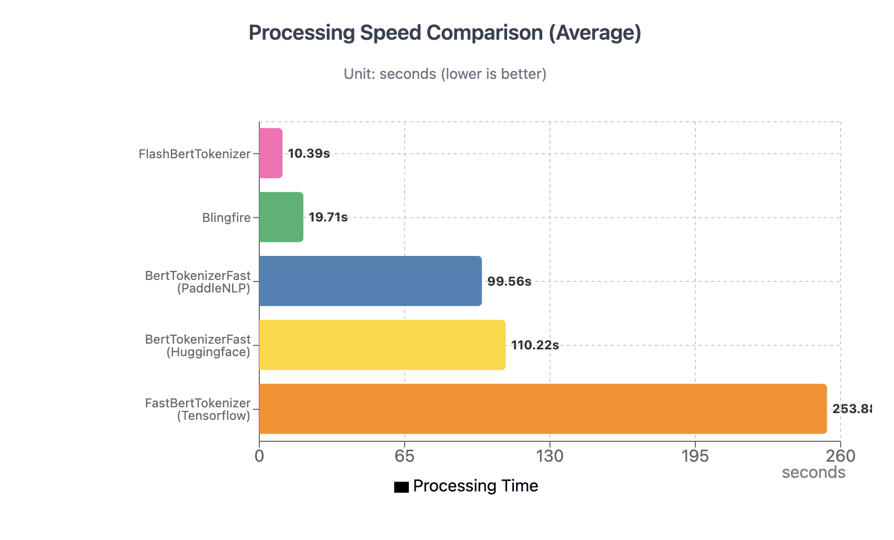
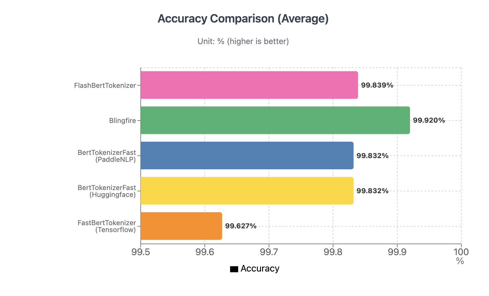
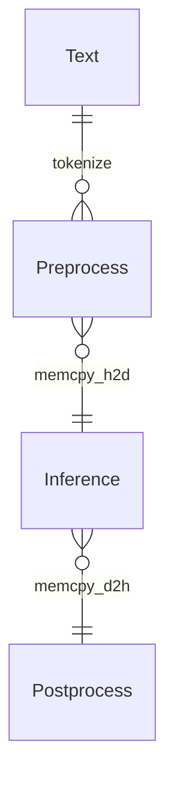

<p align="center">
  <picture>
    <source media="(prefers-color-scheme: dark)" srcset="https://github.com/NLPOptimize/flash-tokenizer/blob/main/assets/FlashTokenizer_main_dark.png?raw=true">
    
  </picture>
</p>
<h1 align="center">
The world's fastest CPU tokenizer library!
</h1>


## EFFICIENT AND OPTIMIZED TOKENIZER ENGINE FOR LLM INFERENCE SERVING

[FlashTokenizer](https://pypi.org/project/flash-tokenizer/) is a **high-performance tokenizer implementation in C++ of the BertTokenizer used for LLM inference**. It has the highest speed and accuracy of any tokenizer, such as [FlashAttention](https://github.com/Dao-AILab/flash-attention) and [FlashInfer](https://github.com/flashinfer-ai/flashinfer), and is 9~11 times faster than `BertTokenizerFast` in transformers.


> [!NOTE]  
> ### Why?
> - We need a tokenizer that is faster, more accurate, and easier to use than [Huggingface's BertTokenizerFast](https://github.com/huggingface/transformers/blob/main/src/transformers/models/bert/tokenization_bert_fast.py). ([link1](https://stackoverflow.com/questions/75595699/huggingfaces-berttokenizerfast-is-between-39000-and-258300-times-slower-than-ex), [link2](https://github.com/PaddlePaddle/PaddleNLP/issues/8565), [link3](https://blog.csdn.net/xhw205/article/details/129578988))
> - [PaddleNLP's BertTokenizerFast](https://paddlenlp.readthedocs.io/en/stable/_modules/paddlenlp/experimental/faster_tokenizer.html) achieves a 1.2x performance improvement by implementing [Huggingface's Rust version](https://github.com/huggingface/tokenizers) in `C++`.  However, using it requires installing both the massive [PaddlePaddle](https://github.com/PaddlePaddle/Paddle) and [PaddleNLP](https://github.com/PaddlePaddle/PaddleNLP) packages.
> - [Tensorflow-text's FastBertTokenizer](https://www.tensorflow.org/text/api_docs/python/text/FastBertTokenizer) actually demonstrates slower performance in comparison.
> - [Microsoft's Blingfire](https://github.com/microsoft/BlingFire) **takes over 8 hours** to train on custom data and shows relatively lower accuracy.
> - [Rapid's cuDF](https://github.com/rapidsai/cudf) provides a GPU-based BertTokenizer, but it suffers from accuracy issues.
> - Unfortunately, [FastBertTokenizer](https://github.com/georg-jung/FastBertTokenizer) and [BertTokenizers](https://github.com/NMZivkovic/BertTokenizers) developed in `C#` and cannot be used in `Python`.
> *(As a side note, I don't know C#, but I believe once something is implemented in C#, it shouldn't have "Fast" in its name.)*
>
> - This is why we developed `FlashTokenizer`. It can be easily installed via `pip` and is **developed in C++ for straightforward maintenance**. Plus, it guarantees extremely fast speeds. We've created an implementation that's faster than Blingfire and easier to use. FlashTokenizer is implemented using the **LinMax Tokenizer** proposed in [Fast WordPiece Tokenization](https://arxiv.org/abs/2012.15524), enabling tokenization in linear time. Finally It supports **parallel processing at the C++ level for batch encoding**, delivering outstanding speed.
> 


<p align="center">
  <picture>
    <source media="(prefers-color-scheme: dark)" srcset="https://github.com/NLPOptimize/flash-tokenizer/blob/main/assets/Banner_dark.png?raw=true">
    
  </picture>
</p>


<p>


</p><br>

* * *

### FlashTokenizer includes the following core features

> [!TIP]
> 
>  * Implemented in C++17 and is fastest when built with GNUC.
>     * MacOS: `g++(14.2.0)` is faster than `clang++(16.0.0)`.
>     * Windows: `g++(8.1.0)-MinGW64` is faster than `Visual Studio 2019`.
>     * Ubuntu: `g++(11.4.0)` is faster than `clang++(14.0.0)`. 
>
> * Equally fast in Python via pybind11.
> * Blingfire was difficult to use in practice due to its low accuracy, but FlashBertTokenizer has both high accuracy and high speed.
> * Although it's only implemented as a single thread, it's capable of 40K RPS in C++ and 25K RPS in Python, and it's thread-safe, so you can go even faster with multi-threading if you need to.


## News

> [!IMPORTANT]  
> **[Mar 21 2025]**
> - Improving Tokenizer Accuracy
> 
> **[Mar 19 2025]** 
> - Memory reduction and slight performance improvement by applying LinMaxMatching from [Aho–Corasick](https://en.wikipedia.org/wiki/Aho%E2%80%93Corasick_algorithm) algorithm.
> - Improved branch pipelining of all functions and force-inline applied.
> - Removed unnecessary operations of `WordpieceTokenizer(Backward)`.
> - Optimizing all functions to operate except for [Bloom filter](https://en.wikipedia.org/wiki/Bloom_filter) is faster than caching.
> - `punctuation`,` control`, and `whitespace` are defined as constexprs in advance and used as Bloom filters.
> - Reduce unnecessary memory allocation with statistical memory profiling.
> -  In ✨FlashTokenizer✨, `bert-base-uncased` can process **35K** texts per second on a single core, with an approximate processing time of **28ns** per text.
> 
> **[Mar 18 2025]** 
> - Improvements to the accuracy of the BasicTokenizer have improved the overall accuracy and, in particular, produce more accurate results for Unicode input.
>
>**[Mar 14 2025]** 
> - The performance of the `WordPieceTokenizer` and `WordPieceBackwordTokenizer` has been improved using [Trie](https://en.wikipedia.org/wiki/Trie), which was introduced in [Fast WordPiece Tokenization](https://arxiv.org/abs/2012.15524).
> - Using `FastPoolAllocator` in `std::list` improves performance in SingleEncoding, but it is not thread-safe, so `std::list<std::string>` is used as is in BatchEncoding. In BatchEncoding, `OPENMP` is completely removed and only `std::thread` is used.
> 
> **[Mar 10 2025]** 
> - Performance improvements through faster token mapping with robin_hood and memory copy minimization with **std::list**.
> 
> 
> #### Token Ids Map Table Performance Test.
> 
> Token and Ids Map used the fastest `robin_hood::unordered_flat_map<std::string, int>`.
>  
> **[Mar 09 2025]** Completed development of flash-tokenizer for BertTokenizer.


## 1. Installation

### Requirements
 * `Windows(AMD64)`, `MacOS(ARM64)`, `Ubuntu(x86-64)` .
 * `g++` / `clang++` / `MSVC`.
 * python 3.9 ~ 3.12.

### Install from [PIP](https://pypi.org/project/flash-tokenizer/)
```bash
# Windows(Visual Studio)
pip install -U flash-tokenizer
```
```bash
# Ubuntu
sudo apt install gcc g++ make cmake -y
pip install setuptools wheel build pybind11
CC=gcc CXX=g++ pip install -U flash-tokenizer
```
```bash
# MacOS
brew install gcc
CC=gcc CXX=g++ pip install -U flash-tokenizer
```

### Install from Source
```bash
git clone https://github.com/NLPOptimize/flash-tokenizer
cd flash-tokenizer
pip install .
```


## 2. Usage

```python
from flash_tokenizer import FlashBertTokenizer
tokenizer = FlashBertTokenizer("path/to/vocab.txt", do_lower_case=True)
# Tokenize text
ids = tokenizer("Hello, world!")
print(ids)
```

## 3. Other Implementations


<p>


</p>


Most [BERT](https://arxiv.org/abs/1810.04805)-based models use the [WordPiece Tokenizer](https://static.googleusercontent.com/media/research.google.com/ja//pubs/archive/37842.pdf), whose code can be found [here](https://github.com/google-research/bert/blob/master/tokenization.py).
(A simple implementation of Huggingface can be found [here](https://github.com/huggingface/transformers/blob/main/src/transformers/models/bert/tokenization_bert.py)).

Since the BertTokenizer is a CPU intensive algorithm, inference can be a bottleneck, and unoptimized tokenizers can be severely slow. A good example is the [BidirectionalWordpieceTokenizer](https://github.com/snunlp/KR-BERT/blob/master/krbert_tensorflow/tokenization_ranked.py) introduced in [KR-BERT](https://arxiv.org/abs/2008.03979). Most of the code is the same, but the algorithm traverses the sub token backwards and writes a larger value compared to the forward traversal. The paper claims accuracy improvements, but it's hard to find other quantitative metrics, and the accuracy improvements aren't significant, and the tokenizer is seriously slowed down.

* transformers (Rust Impl, PyO3)
* paddlenlp (C++ Impl, pybind)
* tensorflow-text (C++ Impl, pybind)
* blingfire (C++ Impl, Native binary call)

Most developers will either use `transformers.BertTokenizer` or `transformers.AutoTokenizer`, but using `AutoTokenizer` will return `transformers.BertTokenizerFast`.

Naturally, it's faster than BertTokenizer, but the results aren't exactly the same, which means you're already giving up 100% accuracy starting with the tokenizer.

BertTokenizer is not only provided by transformers. [PaddleNLP](https://github.com/PaddlePaddle/PaddleNLP) and [tensorflow-text](https://www.tensorflow.org/text) also provide BertTokenizer.

Then there's [Blingfire](https://github.com/microsoft/BlingFire), which is developed by Microsoft and is being abandoned.

PaddleNLP requires PaddlePaddle and provides tokenizer functionality starting with version 3.0rc. You can install it as follows

```bash
##### Install PaddlePaddle, PaddleNLP
python -m pip install paddlepaddle==3.0.0b1 -i https://www.paddlepaddle.org.cn/packages/stable/cpu/
pip install --upgrade paddlenlp==3.0.0b3
##### Install transformers
pip install transformers==4.47.1
##### Install tf-text
pip install tensorflow-text==2.18.1
##### Install blingfire
pip install blingfire
```


With the exception of blingfire, vocab.txt is all you need to run the tokenizer right away. 
(blingfire also requires only vocab.txt and can be used after 8 hours of learning).

The implementations we'll look at in detail are `PaddleNLP's BertTokenizerFast` and `blingfire`.

* `blingfire`: Uses a [Deterministic Finite State Machine (DFSM)](https://github.com/microsoft/BlingFire/blob/master/doc/Bling_Fire_Tokenizer_Algorithms.pdf) to eliminate one linear scan and unnecessary comparisons, resulting in a time of O(n), which is impressive.
  * **Advantages**: **5-10x faster than other implementations**.
  * **Disadvantages**: Long training time (8 hours) and lower accuracy than other implementations. (+Difficult to get help due to de facto development hiatus).
* `PaddleNLP`: As shown in the experiments below, PaddleNLP is always faster than BertTokenizerFast (HF) to the same number of decimal places, and is always faster on any OS, whether X86 or Arm.
  * **Advantages**:  **Internal implementation is in C++** Compared to `transformers.BertTokenizerFast` implemented in Rust, it is 1.2x faster while outputting exactly the same values.
    * You can't specify `pt(pytorch tensor)` in `return_tensors`, but this is not a problem.
  * **Disadvantages**: none, other than the need to install PaddlePaddle and PaddleNLP.

## 4. Performance test


### 4.1 Performance test (Single text encoding)

Accuracy is the result of measuring [google's BertTokenizerFast](https://github.com/google-research/bert/blob/master/tokenization.py) as a baseline. If even one of the `input_ids` is incorrect, the answer is considered incorrect.


<p align="center">
  <picture>
    <source media="(prefers-color-scheme: dark)" srcset="./assets/comp_speed_dark.png">
    
  </picture>
</p>

<p align="center">
  <picture>
    <source media="(prefers-color-scheme: dark)" srcset="./assets/comp_accuracy_dark.png">
    
  </picture>
</p>


<details>
<summary> Tokenizer Performance Comparison </summary>

#### [google-bert/bert-base-cased](https://huggingface.co/google-bert/bert-base-cased)

| Tokenizer                      | Elapsed Time | texts     | Accuracy |
|--------------------------------|----------------:|-----------:|------------:|
| BertTokenizerFast(Huggingface) | 84.3700s     | 1,000,000 | 99.9226% |
| BertTokenizerFast(PaddleNLP)   | 75.6551s     | 1,000,000 | 99.9226% |
| FastBertTokenizer(Tensorflow)  | 219.1259s    | 1,000,000 | 99.9160% |
| Blingfire                      | 13.6183s     | 1,000,000 | 99.8991% |
| **FlashBertTokenizer**             | 8.1968s      | 1,000,000 | 99.8216% |

#### [google-bert/bert-base-uncased](https://huggingface.co/google-bert/bert-base-uncased)

| Tokenizer                      |   Elapsed Time |     texts |   Accuracy |
|--------------------------------|----------------:|-----------:|------------:|
| BertTokenizerFast(Huggingface) |       91.7882s | 1,000,000 |   99.9326% |
| BertTokenizerFast(PaddleNLP)   |       83.6839s | 1,000,000 |   99.9326% |
| FastBertTokenizer(Tensorflow)  |      204.2240s | 1,000,000 |   99.1379% |
| Blingfire                      |       13.2374s | 1,000,000 |   99.8588% |
| **FlashBertTokenizer**             |        7.6313s | 1,000,000 |   99.6884% |

#### [google-bert/bert-base-multilingual-cased](https://huggingface.co/google-bert/bert-base-multilingual-cased)


| Tokenizer                      | Elapsed Time | texts     | Accuracy |
|--------------------------------|----------------:|-----------:|------------:|
| BertTokenizerFast(Huggingface) | 212.1570s    | 2,000,000 | 99.7964% |
| BertTokenizerFast(PaddleNLP)   | 193.9921s    | 2,000,000 | 99.7964% |
| FastBertTokenizer(Tensorflow)  | 394.1574s    | 2,000,000 | 99.7892% |
| Blingfire                      | 38.9013s     | 2,000,000 | 99.9780% |
| **FlashBertTokenizer**             | 20.4570s     | 2,000,000 | 99.8970% |


#### [beomi/kcbert-base](https://github.com/Beomi/KcBERT)

| Tokenizer                      |   Elapsed Time |     texts |   Accuracy |
|--------------------------------|----------------:|-----------:|------------:|
| BertTokenizerFast(Huggingface) |       52.5744s | 1,000,000 |   99.6754% |
| BertTokenizerFast(PaddleNLP)   |       44.8943s | 1,000,000 |   99.6754% |
| FastBertTokenizer(Tensorflow)  |      198.0270s | 1,000,000 |   99.6639% |
| Blingfire                      |       13.0701s | 1,000,000 |   99.9434% |
| **FlashBertTokenizer**             |        5.2601s | 1,000,000 |   99.9484% |


#### [KR-BERT](https://github.com/snunlp/KR-BERT)


| Tokenizer                                    |   Elapsed Time |     texts |   Accuracy |
|--------------------------------|----------------:|-----------:|------------:|
| BertTokenizerBidirectional(KR-BERT Original) |      128.3320s | 1,000,000 |  100.0000% |
| **FlashBertTokenizer(Bidirectional)**                           |       10.4492s | 1,000,000 |   99.9631% |


</details>





## 6. Compatibility

FlashBertTokenizer can be used with any framework.  CUDA version compatibility for each framework is also important for fast inference of LLMs.

 * [PyTorch](https://pytorch.org/) no longer supports installation using conda.
 * [ONNXRUNTIME](https://onnxruntime.ai/docs/execution-providers/CUDA-ExecutionProvider.html#cuda-12x) is separated by CUDA version.
 * PyTorch is also looking to ditch CUDA 12.x in favor of the newer CUDA 12.8. However, the trend is to keep CUDA 11.8 in all frameworks.
   * CUDA 12.x was made for the newest GPUs, Hopper and Blackwell, and on GPUs like Volta, CUDA 11.8 is faster than CUDA 12.x.


| DL Framework | Version | OS   | CPU  | CUDA 11.8 | CUDA 12.3 | CUDA 12.4 | CUDA 12.6 | CUDA 12.8 |
| ------------ | ----|---- | ---- | --------- | ----|----- | --------- | --------- |
| PyTorch | 2.6| Linux, Windows | ⚪|⚪|❌|⚪| ⚪ |    ❌      |
| PyTorch | 2.7|Linux, Windows|⚪|⚪|❌|❌|⚪|⚪|
| ONNXRUNTIME(11) | 1.20.x| Linux, Windows|⚪|⚪|❌|❌|❌|❌|
| ONNXRUNTIME(12) | 1.20.x| Linux, Windows|⚪|❌|⚪|⚪|⚪|⚪|
| PaddlePaddle | 3.0-beta | Linux, Windows|⚪|⚪|❌|❌|❌|❌|


## 7. GPU Tokenizer

Here is an example of installing and running cuDF in [Run State of the Art NLP Workloads at Scale with RAPIDS, HuggingFace, and Dask](https://developer.nvidia.com/blog/run-state-of-the-art-nlp-workloads-at-scale-with-rapids-huggingface-and-dask/#:~:text=,and%20then%20used%20in%20subsequent).
*(It's incredibly fast)*

You can run WordPiece Tokenizer on GPUs on [rapids(cudf)](https://docs.rapids.ai/).
 * [Implemention](https://github.com/rapidsai/cudf/blob/0e99ec3ec15b8b0ebe68bd884c7d22d600e9259e/python/cudf/cudf/core/wordpiece_tokenize.py#L10)
 * [Example](https://github.com/rapidsai/cudf/blob/0e99ec3ec15b8b0ebe68bd884c7d22d600e9259e/python/cudf/cudf/tests/text/test_subword_tokenizer.py#L244)

As you can see in [how to install rapids](https://docs.rapids.ai/install/), it only supports Linux and the CUDA version is not the same as other frameworks, so [docker](https://hub.docker.com/r/rapidsai/base) is the best choice, which is faster than CPU for batch processing but slower than CPU for streaming processing.

## TODO

- [x] [BidirectionalWordPieceTokenizer](https://github.com/snunlp/KR-BERT/blob/master/krbert_tensorflow/tokenization_ranked.py)
- [x] BatchEncoder with Multithreading. 
- [ ] ~~CUDA Version.~~
- [x] Replace `std::list` to `boost::intrusive::list`.
- [ ] [MaxMatch-Dropout: Subword Regularization for WordPiece](https://arxiv.org/abs/2209.04126) Option.
- [ ] SIMD
- [ ] Use stack memory for reduce memory allocation. (C-Style, [alloca](https://man7.org/linux/man-pages/man3/alloca.3.html), [_alloca](https://learn.microsoft.com/ko-kr/cpp/c-runtime-library/reference/alloca?view=msvc-170))
- [ ] Support for parallel processing option for single encode.
- [ ] `circle.ai`
  - [ ] Implement distribution of compiled wheel packages for installation.


## Acknowledgement

FlashTokenizer is inspired by [FlashAttention](https://github.com/Dao-AILab/flash-attention), [FlashInfer](https://github.com/flashinfer-ai/flashinfer), [FastBertTokenizer](https://github.com/georg-jung/FastBertTokenizer) and [tokenizers-cpp](https://github.com/mlc-ai/tokenizers-cpp) projects.


## Performance comparison

* https://fastberttokenizer.gjung.com/ (C# Impl)
* https://github.com/huggingface/tokenizers (Rust Impl)
* BPE
  * https://github.com/openai/tiktoken


## References

* https://medium.com/@techhara/which-bert-tokenizer-is-faster-b832aa978b46
* https://medium.com/@atharv6f_47401/wordpiece-tokenization-a-bpe-variant-73cc48865cbf
* https://www.restack.io/p/transformer-models-bert-answer-fast-berttokenizerfast-cat-ai
* https://medium.com/@anmolkohli/my-notes-on-bert-tokenizer-and-model-98dc22d0b64
* https://nocomplexity.com/documents/fossml/nlpframeworks.html
* https://github.com/martinus/robin-hood-hashing
