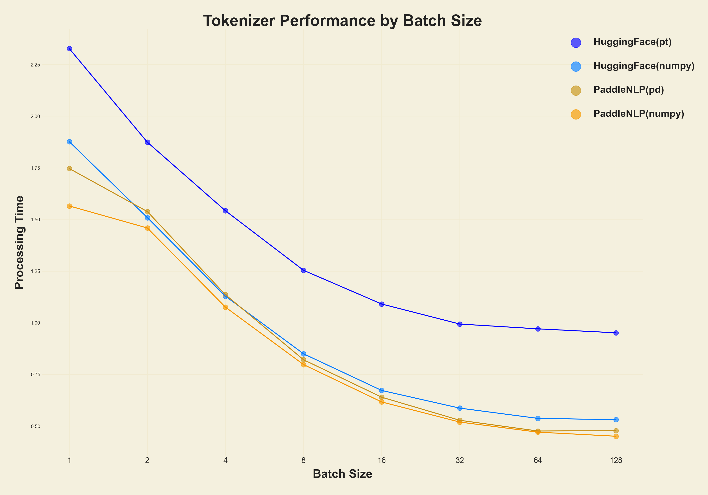
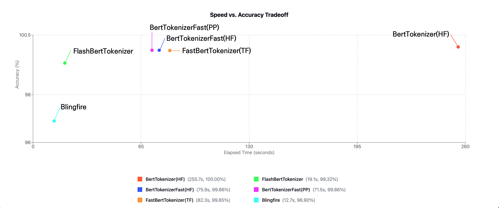
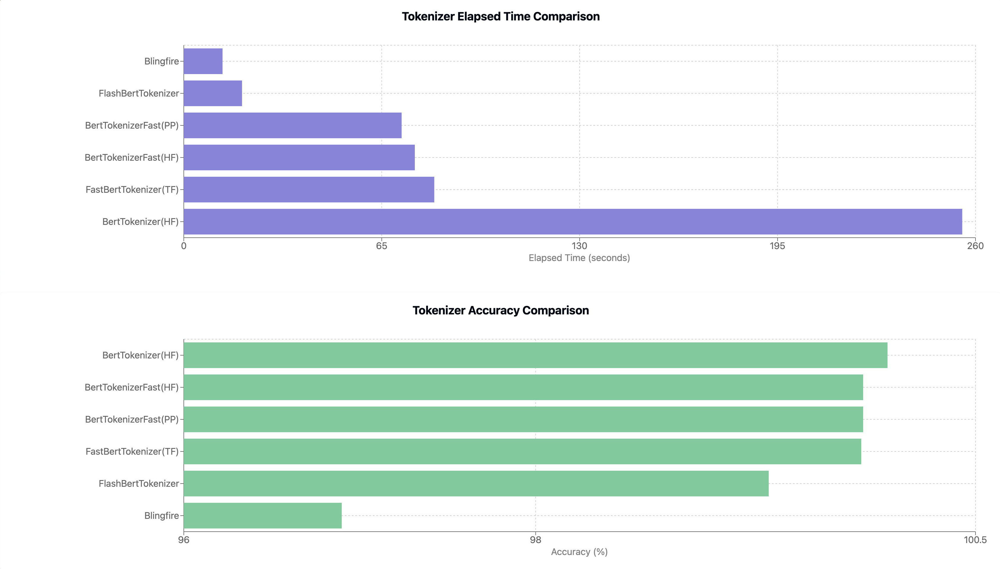
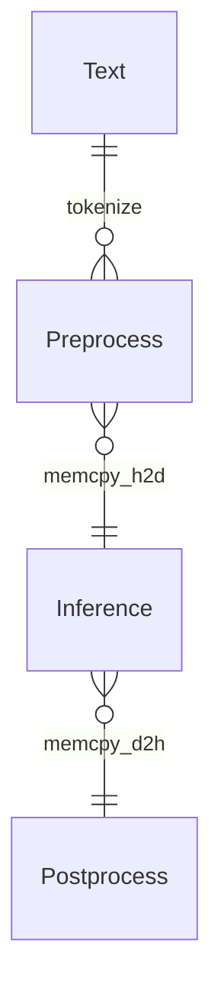

<p align="center">
  <picture>
    <source media="(prefers-color-scheme: dark)" srcset="./assets/FlashTokenizer_main_dark.png">
    
  </picture>
</p>
<h1 align="center">
Tokenizer Library for LLM Serving
</h1>


### EFFICIENT AND OPTIMIZED TOKENIZER ENGINE FOR LLM INFERENCE SERVING


FlashTokenizer is a high-performance tokenizer implementation in C++ of the BertTokenizer used for LLM inference. It has the highest speed and accuracy of any tokenizer, such as [FlashAttention](https://github.com/Dao-AILab/flash-attention) and [FlashInfer](https://github.com/flashinfer-ai/flashinfer), and is 4-5 times faster than BertTokenizerFast in transformers.


<p>


</p><br>

* * *

FlashTokenizer includes the following core features
 * Implemented in C++17 and is fastest when built with LLVM.
 * Equally fast in Python via pybind11.
 * Blingfire was difficult to use in practice due to its low accuracy, but FlashBertTokenizer has both high accuracy and high speed.
 * 


## News

 * [Mar 9 2025] Completed development of flash-tokenizer for BertTokenizer.


## 1. Installation

### Requirements

 * clang++
 * g++
 * MSVC
 * python3.8 ~ 3.12

### Install from PIP
```bash
pip install -U flash-tokenizer
```


## 2. Usage

```python
from flash_tokenizer import FlashBertTokenizer
tokenizer = FlashBertTokenizer("path/to/vocab.txt", do_lower_case=True)
# Tokenize text
ids = tokenizer("Hello, world!")
print(ids)
```


## 3. Other Implementations

Most [BERT](https://arxiv.org/abs/1810.04805)-based models use the [WordPiece Tokenizer](https://static.googleusercontent.com/media/research.google.com/ja//pubs/archive/37842.pdf), whose code can be found [here](https://github.com/google-research/bert/blob/master/tokenization.py).
(A simple implementation of Huggingface can be found [here](https://github.com/huggingface/transformers/blob/main/src/transformers/models/bert/tokenization_bert.py)).

Since the BertTokenizer is a CPU intensive algorithm, inference can be a bottleneck, and unoptimized tokenizers can be severely slow. A good example is the [BidirectionalWordpieceTokenizer](https://github.com/snunlp/KR-BERT/blob/master/krbert_tensorflow/tokenization_ranked.py) introduced in [KR-BERT](https://arxiv.org/abs/2008.03979). Most of the code is the same, but the algorithm traverses the sub token backwards and writes a larger value compared to the forward traversal. The paper claims accuracy improvements, but it's hard to find other quantitative metrics, and the accuracy improvements aren't significant, and the tokenizer is seriously slowed down.

* transformers (Rust Impl, PyO3)
* paddlenlp (C++ Impl, pybind)
* tensorflow-text (C++ Impl, pybind)
* blingfire (C++ Impl, Native binary call)

Most developers will either use `transformers.BertTokenizer` or `transformers.AutoTokenizer`, but using `AutoTokenizer` will return `transformers.BertTokenizerFast`.

Naturally, it's faster than BertTokenizer, but the results aren't exactly the same, which means you're already giving up 100% accuracy starting with the tokenizer.

BertTokenizer is not only provided by transformers. [PaddleNLP](https://github.com/PaddlePaddle/PaddleNLP) and [tensorflow-text](https://www.tensorflow.org/text) also provide BertTokenizer.

Then there's [Blingfire](https://github.com/microsoft/BlingFire), which is developed by Microsoft and is being abandoned.

PaddleNLP requires PaddlePaddle and provides tokenizer functionality starting with version 3.0rc. You can install it as follows

```bash
##### Install PaddlePaddle, PaddleNLP
python -m pip install paddlepaddle==3.0.0b1 -i https://www.paddlepaddle.org.cn/packages/stable/cpu/
pip install --upgrade paddlenlp==3.0.0b3

##### Install transformers
pip install transformers==4.47.1

##### Install tf-text
pip install tensorflow-text==2.18.1

##### Install blingfire
pip install blingfire
```


With the exception of blingfire, vocab.txt is all you need to run the tokenizer right away. 
(blingfire also requires only vocab.txt and can be used after 8 hours of learning).

The implementations we'll look at in detail are `PaddleNLP's BertTokenizerFast` and `blingfire`.

* `blingfire`: Uses a [Deterministic Finite State Machine (DFSM)](https://github.com/microsoft/BlingFire/blob/master/doc/Bling_Fire_Tokenizer_Algorithms.pdf) to eliminate one linear scan and unnecessary comparisons, resulting in a time of O(n), which is impressive.
  * **Advantages**: **5-10x faster than other implementations**.
  * **Disadvantages**: Long training time (8 hours) and lower accuracy than other implementations. (+Difficult to get help due to de facto development hiatus).
* `PaddleNLP`: As shown in the experiments below, PaddleNLP is always faster than BertTokenizerFast (HF) to the same number of decimal places, and is always faster on any OS, whether X86 or Arm.
  * **Advantages**:  **Internal implementation is in C++** Compared to `transformers.BertTokenizerFast` implemented in Rust, it is 1.2x faster while outputting exactly the same values.
    * You can't specify `pt(pytorch tensor)` in `return_tensors`, but this is not a problem.[^1]
  * **Disadvantages**: none, other than the need to install PaddlePaddle and PaddleNLP.

## 4. Performance test

### 4.1 Performance test (Batch text encoding)


The graph below compares `transformers.BertTokenizerFast` and `paddlenlp.transformers.bert.tokenizer_fast.BertTokenizerFast` for batch size.

Both libraries are faster to return as `np.ndarray`. Perhaps the implementations have logic to convert to `pt` or `pd` at the end, which takes longer.


<p align="center">
  <picture>
    <source media="(prefers-color-scheme: dark)" srcset="./assets/BatchTest_dark.png">
    
  </picture>
</p>


|   BatchSize |   transformers(pt) |   paddlenlp(pd) |   transformers(np) |   paddlenlp(np) |
|-------------|--------------------|-----------------|--------------------|-----------------|
|           1 |           2.32744  |        1.74695  |           1.87685  |        1.56597  |
|           2 |           1.87427  |        1.53865  |           1.50911  |        1.45918  |
|           4 |           1.54254  |        1.13622  |           1.12902  |        1.07593  |
|           8 |           1.25432  |        0.821463 |           0.850269 |        0.798163 |
|          16 |           1.09129  |        0.640243 |           0.67293  |        0.617309 |
|          32 |           0.994335 |        0.528553 |           0.587379 |        0.519887 |
|          64 |           0.971175 |        0.476652 |           0.537753 |        0.471145 |
|         128 |           0.952003 |        0.478113 |           0.531592 |        0.451384 |

[^1]: As you can see in the graph above, returning to `pt(pytorch tensor)'` becomes very slow. 

### 4.2 Performance test (Single text encoding)

Accuracy is the result of measuring `transformers.BertTokenizer` as a baseline. If even one of the `input_ids` is incorrect, the answer is considered incorrect.
Surprisingly, the performance of `tensorflow-text` is much faster than before. However, there is still no advantage for `tensorflow-text' when comparing the four libraries.


| Tokenizer             | Elapsed Time (s) |   titles | Accuracy (%) |
|-----------------------|----------------|----------|------------|
| BertTokenizer(Huggingface)     |       255.651  |  404,464 |   100 (Baseline)   |
| ✨ **FlashBertTokenizer**    | **19.1325** ➡️ **16.526** 🔺 |  404,464 | 99.3248 ➡️ 99.8442 🔺 |
| BertTokenizerFast(HF) |        73.3019 |  404,464 |    99.8615 |
| BertTokenizerFast(PP) |        64.0603 |  404,464 |    99.8615 |
| FastBertTokenizer(TF) |        77.6923 |  404,464 |    99.8507 |
| Blingfire             |        11.5904 |  404,464 |    96.8979 |

For both `single text` and `batch text`, PaddleNLP's implementation is always faster than HuggingFace's implementation, and the results are exactly the same, so there is no unique advantage of HuggingFace's `transformers.BertTokenizerFast`.

Now you may have to make a decision between `speed (blingfire) vs `balance (PaddleNLP).

BertTokenizer requires a fast [single-core CPU](https://www.cpubenchmark.net/singleThread.html) to get fast results.

The `flash-tokenizer`, which I implemented because I didn't like the other tokenizers, has a clear advantage in both speed and accuracy.


<p align="center">
  <picture>
    <source media="(prefers-color-scheme: dark)" srcset="./assets/TokenizerPerformanceGraph_dark.png">
    
  </picture>
</p>

<p align="center">
  <picture>
    <source media="(prefers-color-scheme: dark)" srcset="./assets/TokenizerPerformanceBar_dark.jpg">
    
  </picture>
</p>




## TODO

- [ ] [BidirectionalWordPieceTokenizer](https://github.com/snunlp/KR-BERT/blob/master/krbert_tensorflow/tokenization_ranked.py)


## Acknowledgement

FlashTokenizer is inspired by [FlashAttention](https://github.com/Dao-AILab/flash-attention), [FlashInfer](https://github.com/flashinfer-ai/flashinfer), [FastBertTokenizer](https://github.com/georg-jung/FastBertTokenizer) and [tokenizers-cpp](https://github.com/mlc-ai/tokenizers-cpp) projects.


## References

* https://medium.com/@techhara/which-bert-tokenizer-is-faster-b832aa978b46
* https://medium.com/@atharv6f_47401/wordpiece-tokenization-a-bpe-variant-73cc48865cbf
* https://www.restack.io/p/transformer-models-bert-answer-fast-berttokenizerfast-cat-ai
* https://medium.com/@anmolkohli/my-notes-on-bert-tokenizer-and-model-98dc22d0b64
* https://nocomplexity.com/documents/fossml/nlpframeworks.html
* https://github.com/martinus/robin-hood-hashing