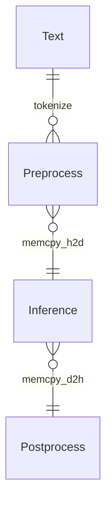

<p align="center">
  <picture>
    <source media="(prefers-color-scheme: dark)" srcset="https://github.com/NLPOptimize/flash-tokenizer/blob/main/assets/FlashTokenizer_main_dark.png?raw=true">
    
  </picture>
</p>
<h1 align="center">
世界上最快的 CPU tokenizer 库！
</h1>


## 针对 LLM 推理服务的高效优化 Tokenizer 引擎


[FlashTokenizer](https://pypi.org/project/flash-tokenizer/) 是一个用于LLM推理的**高性能BertTokenizer的C++实现**。它在速度和准确性方面领先于其他所有分词器，类似于[FlashAttention](https://github.com/Dao-AILab/flash-attention) 和 [FlashInfer](https://github.com/flashinfer-ai/flashinfer)，相比于transformers库中的`BertTokenizerFast`快了**10倍**。


> [!NOTE]  
> ### 为什么？
> - 我们需要一个比 [Huggingface 的 BertTokenizerFast](https://github.com/huggingface/transformers/blob/main/src/transformers/models/bert/tokenization_bert_fast.py) 更快、更准确、更易用的分词器（[链接1](https://stackoverflow.com/questions/75595699/huggingfaces-berttokenizerfast-is-between-39000-and-258300-times-slower-than-ex)、[链接2](https://github.com/PaddlePaddle/PaddleNLP/issues/8565)、[链接3](https://blog.csdn.net/xhw205/article/details/129578988)）。
> - [PaddleNLP 的 BertTokenizerFast](https://paddlenlp.readthedocs.io/en/stable/_modules/paddlenlp/experimental/faster_tokenizer.html) 通过将 [Huggingface 的 Rust 版本](https://github.com/huggingface/tokenizers) 在`C++`中重新实现，性能提高了约 1.2 倍。但使用它需要同时安装庞大的 [PaddlePaddle](https://github.com/PaddlePaddle/Paddle) 和 [PaddleNLP](https://github.com/PaddlePaddle/PaddleNLP) 软件包。
> - [Tensorflow-text 的 FastBertTokenizer](https://www.tensorflow.org/text/api_docs/python/text/FastBertTokenizer) 实际性能更慢。
> - [微软的 Blingfire](https://github.com/microsoft/BlingFire) 在自定义数据上的训练**需要超过8小时**，并且准确性相对较低。
> - [Rapid 的 cuDF](https://github.com/rapidsai/cudf) 提供了基于 GPU 的 BertTokenizer，但存在准确性问题。
> - 遗憾的是，[FastBertTokenizer](https://github.com/georg-jung/FastBertTokenizer) 和 [BertTokenizers](https://github.com/NMZivkovic/BertTokenizers) 是用`C#`开发的，无法在`Python`中使用。

> - 这就是我们开发 `FlashTokenizer` 的原因。它能通过`pip`轻松安装，并且是用`C++`开发的，便于直接维护。此外，它还保证了极快的速度。我们实现了一个比 Blingfire 更快、更易用的分词器。FlashTokenizer 基于论文 [Fast WordPiece Tokenization](https://arxiv.org/abs/2012.15524) 中提出的**LinMax Tokenizer**，实现线性时间复杂度的分词。同时它在`C++`级别上支持**批量编码的并行处理**，能够提供卓越的性能。


<p align="center">
  <picture>
    <source media="(prefers-color-scheme: dark)" srcset="https://github.com/NLPOptimize/flash-tokenizer/blob/main/assets/Banner_dark.png?raw=true">
    
  </picture>
</p>


<p>


</p><br>

* * *

### FlashTokenizer 包含以下核心功能：

> [!TIP]
>
> * 使用 C++17 实现。
>   * **MacOS**：使用 `clang++`。
>   * **Windows**：使用 `Visual Studio 2022`。
>   * **Ubuntu**：使用 `g++`。
>
> * 通过 pybind11 在 Python 中同样拥有高速表现。
> * 在 C++ 层面利用 OPENMP 支持并行处理。 


##  新闻

> [!IMPORTANT]  
> **【2025年4月2日】**
> - 添加性能基准测试代码。
> - 性能基准测试采用 Python 进行，所需的软件包可通过 [setup.sh](./perftest/setup.sh) 安装。
> - 为 `BasicTokenizer` 增加了 `tokenize_early_stop` 功能，略微提升了性能。
> - 在 Windows、Linux 和 macOS 上，[OpenMP](https://www.openmp.org/) 的性能均优于 `std::thread`，因此全面切换为使用 OpenMP。
> 
> **【2025年3月31日】**
> - 提供了各个操作系统的预构建 whl 文件。
>
> **【2025年3月22日】**
> - 将 [DFA](https://blog.cloudflare.com/pt-br/making-waf-ai-models-go-brr/#:~:text=We%20can%20also%20tune%20Aho,settings%20based%20on%20this%20recommendation) 加入 AC Trie 中。
>
> **【2025年3月21日】**
> - 改进分词器的准确性。
>
> **【2025年3月19日】**
> - 使用 [Aho–Corasick 算法](https://en.wikipedia.org/wiki/Aho%E2%80%93Corasick_algorithm) 中的 LinMaxMatching，降低了内存占用，并略微提高了性能。
> - 改进所有函数的分支流水线并强制内联（force-inline）。
> - 移除了 `WordpieceTokenizer(Backward)` 中不必要的操作。
> - 优化了除 [布隆过滤器 (Bloom filter)](https://en.wikipedia.org/wiki/Bloom_filter) 以外的所有函数，性能比缓存更快。
> - 将 `punctuation`、`control` 和 `whitespace` 预先定义为 constexpr，并作为布隆过滤器使用。
> - 通过统计内存分析减少不必要的内存分配。
> - 在 ✨FlashTokenizer✨ 中，`bert-base-uncased` 在单核上每秒可处理约 **35K** 条文本，每条文本的处理时间约为 **28 纳秒**。
>
> **【2025年3月18日】**
> - 改进了 BasicTokenizer 的准确性，整体分词准确性提升，尤其对于 Unicode 输入的准确性显著提高。
>
> **【2025年3月14日】**
> - 通过在 `WordPieceTokenizer` 和 `WordPieceBackwardTokenizer` 中使用 [Trie](https://en.wikipedia.org/wiki/Trie) 数据结构（来自 [Fast WordPiece Tokenization](https://arxiv.org/abs/2012.15524) 论文），大幅提升了性能。
> - 在 SingleEncoding 中使用 `FastPoolAllocator` 改进了 `std::list` 的性能，但该方法线程不安全，因此 BatchEncoding 中继续使用原生 `std::list<std::string>`。同时，BatchEncoding 中完全移除 OPENMP，仅使用 `std::thread`。
>
> **【2025年3月10日】**
> - 使用 robin_hood 优化 token 映射速度，同时采用 `std::list` 降低内存拷贝，提升性能。
>
> #### Token Ids 映射表性能测试：
>
> Token 和 Ids 的映射表使用了性能最优的 `robin_hood::unordered_flat_map<std::string, int>`。
>
> **【2025年3月9日】**
> 完成了适用于 BertTokenizer 的 flash-tokenizer 的开发工作。


## 1. 安装方法

### 系统需求
* 操作系统：`Windows(AMD64)`、`MacOS(ARM64)`、`Ubuntu(x86-64)`。
* 编译器：`g++` / `clang++` / `MSVC`。
* Python版本：`Python 3.8 ~ 3.13`。

### 通过 [PIP](https://pypi.org/project/flash-tokenizer/) 安装


在 Windows 上，你需要安装 [vc_redist.x64.exe](https://github.com/NLPOptimize/flash-tokenizer/releases/download/Packages/VC_redist.x64.exe)。
```bash
# Windows
pip install -U flash-tokenizer
```
```bash
# Linux
pip install -U flash-tokenizer
```
```bash
# MacOS
pip install -U flash-tokenizer
```

### 从源代码安装
```bash
git clone https://github.com/NLPOptimize/flash-tokenizer
cd flash-tokenizer/prj
pip install .
```


## 2. 示例

```python
from flash_tokenizer import BertTokenizerFlash
from transformers import BertTokenizer

titles = [
    '绝不能放弃，世界上没有失败，只有放弃。',
    'is there any doubt about it "None whatsoever"',
    "세상 어떤 짐승이 이를 드러내고 사냥을 해? 약한 짐승이나 몸을 부풀리지, 진짜 짐승은 누구보다 침착하지.",
    'そのように二番目に死を偽装して生き残るようになったイタドリがどうして初めて見る自分をこんなに気遣ってくれるのかと尋ねると「私が大切にする人たちがあなたを大切にするから」と答えては'
]

tokenizer1 = BertTokenizerFlash.from_pretrained('bert-base-multilingual-cased')
tokenizer2 = BertTokenizer.from_pretrained('bert-base-multilingual-cased')

correct = 0
for title in titles:
    print(title)
    tokens1 = tokenizer1.tokenize(title)
    tokens2 = tokenizer2.tokenize(title)
    ids1 = tokenizer1(title, max_length=512, padding="longest").input_ids[0]
    ids2 = tokenizer2(title, max_length=512, padding="longest", return_tensors="np").input_ids[0].tolist()
    if tokens1 == tokens2 and ids1 == ids2:
        correct += 1
        print("Accept!")
    else:
        print("Wrong Answer")
    print(ids1)
    print(ids2)
    print()

print(f'Accuracy: {correct * 100.0 / len(titles):.2f}%')
```

```
绝不能放弃，世界上没有失败，只有放弃。
Accept!
[101, 6346, 2080, 6546, 4284, 3704, 10064, 2087, 5621, 2078, 4917, 4461, 3204, 7480, 10064, 2751, 4461, 4284, 3704, 1882, 102]
[101, 6346, 2080, 6546, 4284, 3704, 10064, 2087, 5621, 2078, 4917, 4461, 3204, 7480, 10064, 2751, 4461, 4284, 3704, 1882, 102]

is there any doubt about it "None whatsoever"
Accept!
[101, 10124, 11155, 11178, 86697, 10978, 10271, 107, 86481, 12976, 11669, 23433, 107, 102]
[101, 10124, 11155, 11178, 86697, 10978, 10271, 107, 86481, 12976, 11669, 23433, 107, 102]

세상 어떤 짐승이 이를 드러내고 사냥을 해? 약한 짐승이나 몸을 부풀리지, 진짜 짐승은 누구보다 침착하지.
Accept!
[101, 9435, 14871, 55910, 9710, 48210, 10739, 35756, 9113, 30873, 31605, 11664, 9405, 118729, 10622, 9960, 136, 9539, 11102, 9710, 48210, 43739, 9288, 10622, 9365, 119407, 12692, 12508, 117, 9708, 119235, 9710, 48210, 10892, 9032, 17196, 80001, 9783, 119248, 23665, 119, 102]
[101, 9435, 14871, 55910, 9710, 48210, 10739, 35756, 9113, 30873, 31605, 11664, 9405, 118729, 10622, 9960, 136, 9539, 11102, 9710, 48210, 43739, 9288, 10622, 9365, 119407, 12692, 12508, 117, 9708, 119235, 9710, 48210, 10892, 9032, 17196, 80001, 9783, 119248, 23665, 119, 102]

そのように二番目に死を偽装して生き残るようになったイタドリがどうして初めて見る自分をこんなに気遣ってくれるのかと尋ねると「私が大切にする人たちがあなたを大切にするから」と答えては
Accept!
[101, 11332, 24273, 2150, 5632, 5755, 1943, 4805, 1980, 2371, 7104, 11592, 5600, 1913, 4814, 1975, 27969, 15970, 21462, 15713, 21612, 10898, 56910, 22526, 22267, 2547, 19945, 7143, 1975, 6621, 2534, 1980, 28442, 60907, 11312, 4854, 7770, 14813, 18825, 58174, 75191, 11662, 3456, 1945, 100812, 1890, 5949, 1912, 3197, 2535, 84543, 2179, 78776, 111787, 22946, 20058, 11377, 3197, 2535, 84543, 16867, 1891, 1940, 6076, 27144, 11588, 102]
[101, 11332, 24273, 2150, 5632, 5755, 1943, 4805, 1980, 2371, 7104, 11592, 5600, 1913, 4814, 1975, 27969, 15970, 21462, 15713, 21612, 10898, 56910, 22526, 22267, 2547, 19945, 7143, 1975, 6621, 2534, 1980, 28442, 60907, 11312, 4854, 7770, 14813, 18825, 58174, 75191, 11662, 3456, 1945, 100812, 1890, 5949, 1912, 3197, 2535, 84543, 2179, 78776, 111787, 22946, 20058, 11377, 3197, 2535, 84543, 16867, 1891, 1940, 6076, 27144, 11588, 102]

Accuracy: 100.00%
```

## 3. 其他实现方式


<p align="center">
  <picture>
    <source media="(prefers-color-scheme: dark)" srcset="./assets/logos_dark.png">
    
  </picture>
</p>


大多数基于 [BERT](https://arxiv.org/abs/1810.04805) 的模型使用 [WordPiece Tokenizer](https://static.googleusercontent.com/media/research.google.com/ja//pubs/archive/37842.pdf)，其代码可以在[这里](https://github.com/google-research/bert/blob/master/tokenization.py)找到。
（Huggingface 提供的简单实现可参考[这里](https://github.com/huggingface/transformers/blob/main/src/transformers/models/bert/tokenization_bert.py)）。

由于 BertTokenizer 是一种CPU密集型算法，推理可能会成为性能瓶颈，未经优化的 tokenizer 可能会非常缓慢。一个典型的例子是[KR-BERT](https://arxiv.org/abs/2008.03979)提出的[BidirectionalWordpieceTokenizer](https://github.com/snunlp/KR-BERT/blob/master/krbert_tensorflow/tokenization_ranked.py)。虽然大部分代码与原版相同，但该算法会逆向遍历子词，并写入比正向遍历更大的值。论文声称其准确性有所提高，但很难找到其他量化指标，实际准确性提升也并不显著，同时 tokenizer 的运行速度也明显降低了。

现有实现包括：

* transformers（Rust 实现，PyO3 封装）
* paddlenlp（C++ 实现，pybind 封装）
* tensorflow-text（C++ 实现，pybind 封装）
* blingfire（C++ 实现，原生二进制调用）

多数开发者通常会使用 `transformers.BertTokenizer` 或 `transformers.AutoTokenizer`，但使用 `AutoTokenizer` 实际上会返回 `transformers.BertTokenizerFast`。

显然，`BertTokenizerFast` 比原版的 BertTokenizer 更快，但两者的结果并非完全一致，这意味着使用更快的实现已经放弃了 100% 的准确性。

此外，BertTokenizer 并非仅由 transformers 提供。[PaddleNLP](https://github.com/PaddlePaddle/PaddleNLP) 和 [tensorflow-text](https://www.tensorflow.org/text) 也提供了自己的 BertTokenizer 实现。

另外还有由微软开发的[Blingfire](https://github.com/microsoft/BlingFire)，但该项目目前已经被放弃。

PaddleNLP 需要安装 PaddlePaddle，并从 3.0rc 版本开始提供 tokenizer 功能。你可以按照以下方式安装：

```bash
##### Install PaddlePaddle, PaddleNLP
python -m pip install paddlepaddle==3.0.0b1 -i https://www.paddlepaddle.org.cn/packages/stable/cpu/
pip install --upgrade paddlenlp==3.0.0b3
##### Install transformers
pip install transformers==4.47.1
##### Install tf-text
pip install tensorflow-text==2.18.1
##### Install blingfire
pip install blingfire
```


除了 Blingfire 外，只需要一个 `vocab.txt` 文件，就可以立即使用其他所有 tokenizer。
（Blingfire 也只需 `vocab.txt`，但需要经过8小时的训练后才能使用。）

下面我们将详细介绍 `PaddleNLP 的 BertTokenizerFast` 和 `Blingfire` 的实现。

* **Blingfire**: 使用[确定性有限状态机 (DFSM)](https://github.com/microsoft/BlingFire/blob/master/doc/Bling_Fire_Tokenizer_Algorithms.pdf)，省去一次线性扫描和不必要的比较，时间复杂度达到 O(n)，性能非常出色。
  * **优点**：比其他实现快 **5-10倍**。
  * **缺点**：训练时间过长（8小时），且准确性比其他实现稍低。此外，由于项目实际上已停止开发，获取支持困难。

* **PaddleNLP**: 如下面实验所示，在任何操作系统上（无论是 X86 或 Arm），PaddleNLP 始终比 Huggingface 的 BertTokenizerFast 更快，且精度相同（到小数点后的数值均一致）。
  * **优点**：
    * **内部使用 C++ 实现**，相比于 Huggingface 使用 Rust 实现的 `transformers.BertTokenizerFast`，速度快 1.2 倍，且输出结果完全一致。
    * 虽然不能在 `return_tensors` 中指定 `pt（PyTorch Tensor）`，但这并非实际问题。
  * **缺点**：需要额外安装 PaddlePaddle 和 PaddleNLP 软件包，除此之外没有其他缺点。

## 4. 性能测试

### 4.1 性能测试（单条文本编码）

准确性以 [Google 的 BertTokenizerFast](https://github.com/google-research/bert/blob/master/tokenization.py) 为基准进行测量。如果`input_ids`中存在任何一个错误，则视为结果不准确。


<p align="center">
  <picture>
    <source media="(prefers-color-scheme: dark)" srcset="./assets/comp_speed_dark.png">
    
  </picture>
</p>

<p align="center">
  <picture>
    <source media="(prefers-color-scheme: dark)" srcset="./assets/comp_accuracy_dark.png">
    
  </picture>
</p>


### Tokenizer 性能比较

#### [google-bert/bert-base-chinese](https://huggingface.co/google-bert/bert-base-chinese)

| Tokenizer                      |   Elapsed Time |     texts |   Accuracy |
|--------------------------------|----------------|-----------|------------|
| FlashBertTokenizer             |       12.4959s | 1,000,000 |   99.5057% |
| Blingfire                      |       18.9008s | 1,000,000 |   61.1254% |
| rust_tokenizers(guillaume-be)  |       57.4387s | 1,000,000 |   99.9957% |
| BertTokenizerFast(PaddleNLP)   |      143.5012s | 1,000,000 |   99.1475% |
| BertTokenizerFast(Huggingface) |      152.8926s | 1,000,000 |   99.1475% |


以下是在 `.Net9` 中运行 [FastBertTokenizer (C#)](https://fastberttokenizer.gjung.com) 和在 C++ 中运行 FlashBertTokenizer 的结果。FlashBertTokenizer 在中文上展现出更高的准确性。


| Tokenizer                      |   Elapsed Time |     texts |   Accuracy |
|--------------------------------|----------------|-----------|------------|
|FastBertTokenizer (C#)|21.9430s|2000001|66.4466%|
|FlashBertTokenizer (C++) | 10.6592s | 2000001|99.9002%|


#### [google-bert/bert-base-cased](https://huggingface.co/google-bert/bert-base-cased)

| Tokenizer                      | Elapsed Time | texts     | Accuracy |
|--------------------------------|----------------:|-----------:|------------:|
| BertTokenizerFast(Huggingface) | 84.3700s     | 1,000,000 | 99.9226% |
| BertTokenizerFast(PaddleNLP)   | 75.6551s     | 1,000,000 | 99.9226% |
| FastBertTokenizer(Tensorflow)  | 219.1259s    | 1,000,000 | 99.9160% |
| Blingfire                      | 13.6183s     | 1,000,000 | 99.8991% |
| **FlashBertTokenizer**             | 8.1968s      | 1,000,000 | 99.8216% |

#### [google-bert/bert-base-uncased](https://huggingface.co/google-bert/bert-base-uncased)

| Tokenizer                      |   Elapsed Time |     texts |   Accuracy |
|--------------------------------|----------------:|-----------:|------------:|
| BertTokenizerFast(Huggingface) |       91.7882s | 1,000,000 |   99.9326% |
| BertTokenizerFast(PaddleNLP)   |       83.6839s | 1,000,000 |   99.9326% |
| FastBertTokenizer(Tensorflow)  |      204.2240s | 1,000,000 |   99.1379% |
| Blingfire                      |       13.2374s | 1,000,000 |   99.8588% |
| **FlashBertTokenizer**             |        7.6313s | 1,000,000 |   99.6884% |

#### [google-bert/bert-base-multilingual-cased](https://huggingface.co/google-bert/bert-base-multilingual-cased)


| Tokenizer                      | Elapsed Time | texts     | Accuracy |
|--------------------------------|----------------:|-----------:|------------:|
| BertTokenizerFast(Huggingface) | 212.1570s    | 2,000,000 | 99.7964% |
| BertTokenizerFast(PaddleNLP)   | 193.9921s    | 2,000,000 | 99.7964% |
| FastBertTokenizer(Tensorflow)  | 394.1574s    | 2,000,000 | 99.7892% |
| Blingfire                      | 38.9013s     | 2,000,000 | 99.9780% |
| **FlashBertTokenizer**             | 20.4570s     | 2,000,000 | 99.8970% |


#### [beomi/kcbert-base](https://github.com/Beomi/KcBERT)

| Tokenizer                      |   Elapsed Time |     texts |   Accuracy |
|--------------------------------|----------------:|-----------:|------------:|
| BertTokenizerFast(Huggingface) |       52.5744s | 1,000,000 |   99.6754% |
| BertTokenizerFast(PaddleNLP)   |       44.8943s | 1,000,000 |   99.6754% |
| FastBertTokenizer(Tensorflow)  |      198.0270s | 1,000,000 |   99.6639% |
| Blingfire                      |       13.0701s | 1,000,000 |   99.9434% |
| **FlashBertTokenizer**             |        5.2601s | 1,000,000 |   99.9484% |


| Tokenizer                      |   Elapsed Time |     texts |   Accuracy |
|--------------------------------|----------------|-----------|------------|
| **FlashBertTokenizer**             |        5.1875s | 1,000,001 |   99.9484% |
| Blingfire                      |       13.2783s | 1,000,001 |   99.9435% |
| rust_tokenizers(guillaume-be)  |       16.6308s | 1,000,001 |   99.9829% |
| BertTokenizerFast(PaddleNLP)   |       44.5476s | 1,000,001 |   99.6754% |
| BertTokenizerFast(Huggingface) |       53.2525s | 1,000,001 |   99.6754% |
| FastBertTokenizer(Tensorflow)  |      202.1633s | 1,000,001 |   99.6639% |

#### [microsoft/llmlingua-2-bert-base-multilingual-cased-meetingbank](https://huggingface.co/microsoft/llmlingua-2-bert-base-multilingual-cased-meetingbank)

| Tokenizer                      |   Elapsed Time |     texts |   Accuracy |
|--------------------------------|----------------:|-----------:|------------:|
| BertTokenizerFast(Huggingface) |      208.8858s | 2,000,000 |   99.7964% |
| BertTokenizerFast(PaddleNLP)   |      192.6593s | 2,000,000 |   99.7964% |
| FastBertTokenizer(Tensorflow)  |      413.2010s | 2,000,000 |   99.7892% |
| Blingfire                      |       39.3765s | 2,000,000 |   99.9780% |
| **FlashBertTokenizer**             |       22.8820s | 2,000,000 |   99.8970% |

| Tokenizer                      |   Elapsed Time |     texts |   Accuracy |
|--------------------------------|----------------|-----------|------------|
| **FlashBertTokenizer**             |       22.0901s | 2,000,001 |   99.8971% |
| Blingfire                      |       37.9836s | 2,000,001 |   99.9780% |
| rust_tokenizers(guillaume-be)  |       98.0366s | 2,000,001 |   99.9976% |
| BertTokenizerFast(PaddleNLP)   |      208.6889s | 2,000,001 |   99.7964% |
| BertTokenizerFast(Huggingface) |      219.2644s | 2,000,001 |   99.7964% |
| FastBertTokenizer(Tensorflow)  |      413.9725s | 2,000,001 |   99.7892% |





## 6. 兼容性

FlashBertTokenizer 可以与任何框架一起使用。各框架的 CUDA 版本兼容性对于 LLM 的快速推理也至关重要。

* [PyTorch](https://pytorch.org/) 已不再支持通过 conda 安装。
* [ONNXRUNTIME](https://onnxruntime.ai/docs/execution-providers/CUDA-ExecutionProvider.html#cuda-12x) 根据 CUDA 版本进行了区分。
* PyTorch 也在考虑放弃 CUDA 12.x，转而使用更新的 CUDA 12.8。但整体趋势仍然是各个框架普遍保留对 CUDA 11.8 的支持。
  * CUDA 12.x 是专为最新的 Hopper 和 Blackwell GPU 开发的，而在像 Volta 等较早的 GPU 上，CUDA 11.8 比 CUDA 12.x 更快。


| DL Framework | Version | OS   | CPU  | CUDA 11.8 | CUDA 12.3 | CUDA 12.4 | CUDA 12.6 | CUDA 12.8 |
| ------------ | ----|---- | ---- | --------- | ----|----- | --------- | --------- |
| PyTorch | 2.6| Linux, Windows | ⚪|⚪|❌|⚪| ⚪ |    ❌      |
| PyTorch | 2.7|Linux, Windows|⚪|⚪|❌|❌|⚪|⚪|
| ONNXRUNTIME(11) | 1.20.x| Linux, Windows|⚪|⚪|❌|❌|❌|❌|
| ONNXRUNTIME(12) | 1.20.x| Linux, Windows|⚪|❌|⚪|⚪|⚪|⚪|
| PaddlePaddle | 3.0-beta | Linux, Windows|⚪|⚪|❌|❌|❌|❌|


## 7. GPU Tokenizer

下面是在 [Run State of the Art NLP Workloads at Scale with RAPIDS, HuggingFace, and Dask](https://developer.nvidia.com/blog/run-state-of-the-art-nlp-workloads-at-scale-with-rapids-huggingface-and-dask/#:~:text=,and%20then%20used%20in%20subsequent) 中安装和运行 cuDF 的示例。  
*(速度非常快)*

你可以使用 [rapids(cuDF)](https://docs.rapids.ai/) 在 GPU 上运行 WordPiece Tokenizer。

 * [具体实现代码](https://github.com/rapidsai/cudf/blob/0e99ec3ec15b8b0ebe68bd884c7d22d600e9259e/python/cudf/cudf/core/wordpiece_tokenize.py#L10)
 * [使用示例代码](https://github.com/rapidsai/cudf/blob/0e99ec3ec15b8b0ebe68bd884c7d22d600e9259e/python/cudf/cudf/tests/text/test_subword_tokenizer.py#L244)

如 [rapids 安装指南](https://docs.rapids.ai/install/) 所示，目前 rapids 仅支持 Linux，且 CUDA 版本与其他框架不完全一致，因此推荐使用 [docker 镜像](https://hub.docker.com/r/rapidsai/base)。  
使用 GPU 在批处理时比 CPU 快，但在流式处理（单条数据）时却比 CPU 慢。

[NVIDIA 的官方博客](https://developer.nvidia.com/blog/run-state-of-the-art-nlp-workloads-at-scale-with-rapids-huggingface-and-dask/#:~:text=,and then used in subsequent) 中提供了详细的示例代码和说明。  
使用 cuDF 前，必须先将 `vocab.txt` 转换成如下所示的 [hash_vocab](https://github.com/rapidsai/cudf/blob/branch-25.06/python/cudf/cudf/utils/hash_vocab_utils.py)。  
但存在的问题是，该 `hash_vocab` 转换函数并不支持多语言。因此，如果你的词表中包含英语和中文以外的其他字符，cuDF 的 WordPieceTokenizer 将无法使用。

```python
import cudf
from cudf.utils.hash_vocab_utils import hash_vocab
hash_vocab('bert-base-cased-vocab.txt', 'voc_hash.txt')
```


## 待办事项（TODO）

- [x] [BidirectionalWordPieceTokenizer](https://github.com/snunlp/KR-BERT/blob/master/krbert_tensorflow/tokenization_ranked.py)
- [x] 支持多线程的 BatchEncoder
- [x] 将 `std::list` 替换为 `boost::intrusive::list`
- [x] ~~[MaxMatch-Dropout: Subword Regularization for WordPiece](https://arxiv.org/abs/2209.04126) 选项~~
- [x] 使用栈内存以减少内存分配（C风格，[alloca](https://man7.org/linux/man-pages/man3/alloca.3.html)，[_alloca](https://learn.microsoft.com/ko-kr/cpp/c-runtime-library/reference/alloca?view=msvc-170)）
- [x] ~~为单条编码提供并行处理选项~~
- [ ] `circle.ai`
  - [ ] 实现编译后的 wheel 包分发与安装
- [ ] SIMD 支持
- [ ] CUDA 版本


## 致谢

FlashTokenizer 的开发灵感来源于 [FlashAttention](https://github.com/Dao-AILab/flash-attention)、[FlashInfer](https://github.com/flashinfer-ai/flashinfer)、[FastBertTokenizer](https://github.com/georg-jung/FastBertTokenizer) 以及 [tokenizers-cpp](https://github.com/mlc-ai/tokenizers-cpp) 等项目。


## 性能比较

* **WordPiece**
  * 📒 [huggingface/tokenizers (Rust)](https://github.com/huggingface/tokenizers)
    * transformers.BertTokenizerFast 的 Rust 实现，以 Python 包提供。
    * 🔵 **以 Python 包形式提供。**
  * 🔥 [FastBertTokenizer (C#)](https://fastberttokenizer.gjung.com)
    * 性能极快，但非英文查询的准确性显著降低。
  * ❌ [BertTokenizers (C#)](https://github.com/NMZivkovic/BertTokenizers)
    * 从 [FastBertTokenizer (C#) VS BertTokenizers (C#)](https://github.com/georg-jung/FastBertTokenizer/tree/master?tab=readme-ov-file#comparison-to-berttokenizers) 的比较可确认，`FastBertTokenizer(C#)` 更快。
  * 🔥 [rust-tokenizers (Rust)](https://github.com/guillaume-be/rust-tokenizers)
    * 速度慢于 BertTokenizerFlash 和 Blingfire，但比其他实现更快、更准确。
    * 🔵 **以 Python 包形式提供。**
  * ❌ [tokenizers-cpp (C++)](https://github.com/mlc-ai/tokenizers-cpp)
    * 只是 SentencePiece 和 HuggingFace Rust 实现的封装，性能测试无实际意义。
  * ❌ [bertTokenizer (Java)](https://github.com/ankiteciitkgp/bertTokenizer)
    * Java 实现未纳入比较范围。
  * ✅ [ZhuoruLin/fast-wordpiece (Rust)](https://github.com/ZhuoruLin/fast-wordpiece)
    * 使用 LinMaxMatching 的 Rust 实现，仅限 Rust 环境，性能预计不会超过 C++ 实现。
  * ❌ [huggingface_tokenizer_cpp (C++)](https://github.com/Sorrow321/huggingface_tokenizer_cpp)
    * 朴素的 C++ 实现，性能非常缓慢。
  * ❌ [SeanLee97/BertWordPieceTokenizer.jl (Julia)](https://github.com/SeanLee97/BertWordPieceTokenizer.jl)
    * Julia 实现未纳入比较范围。
  
* **BPE**
  * https://github.com/openai/tiktoken

* **SentencePiece**
  * [google/sentencepiece (C++)](https://github.com/google/sentencepiece)


## ⭐ 历史记录

<a href="https://www.star-history.com/#NLPOptimize/flash-tokenizer&Date">

 <picture>
   <source media="(prefers-color-scheme: dark)" srcset="https://api.star-history.com/svg?repos=NLPOptimize/flash-tokenizer&type=Date&theme=dark" />
   <source media="(prefers-color-scheme: light)" srcset="https://api.star-history.com/svg?repos=NLPOptimize/flash-tokenizer&type=Date" />
   
 </picture>
</a>


## 参考文献

* https://medium.com/@techhara/which-bert-tokenizer-is-faster-b832aa978b46
* https://medium.com/@atharv6f_47401/wordpiece-tokenization-a-bpe-variant-73cc48865cbf
* https://www.restack.io/p/transformer-models-bert-answer-fast-berttokenizerfast-cat-ai
* https://medium.com/@anmolkohli/my-notes-on-bert-tokenizer-and-model-98dc22d0b64
* https://nocomplexity.com/documents/fossml/nlpframeworks.html
* https://github.com/martinus/robin-hood-hashing
* https://arxiv.org/abs/2012.15524
* https://github.com/google/highway
